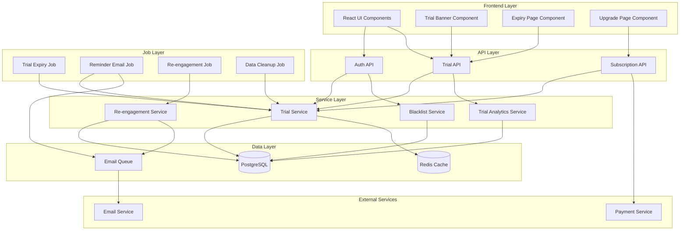
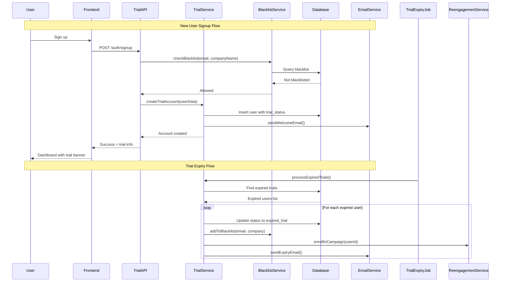

# Requirements Document

> Terminology note: This doc has a local glossary for trial mechanics. For canonical product terms (Workspace, Tenant synonym, etc.) see [`GLOSSARY.md`](GLOSSARY.md).

## Introduction

This specification defines the Free Trial Lifecycle Management system for RawDrive. The system transforms the current unlimited free tier into a time-limited 30-day free trial with Business tier features and limits. After the trial expires, users must upgrade to a paid plan or have their account disabled. The system includes automated email communications for trial reminders, expiry notifications, and post-expiry re-engagement campaigns.

## Glossary

- **Free_Trial_System**: The automated system managing trial periods, account states, and lifecycle communications
- **Trial_User**: A user who has signed up for the free trial and has not yet upgraded to a paid subscription
- **Trial_Period**: The 30-day duration during which a user has access to Business tier features
- **Trial_Expiry_Date**: The date when the trial period ends, calculated as signup date + 30 days
- **Account_State**: The current status of a user account (active_trial, expired_trial, upgraded, disabled)
- **Blacklist**: A registry of email addresses and company names that have previously used a free trial and are not eligible for another
- **Re-engagement_Campaign**: Automated email sequence sent to expired trial users to encourage subscription
- **Upgrade_Prompt**: In-app notification requesting the user to upgrade their subscription
- **Grace_Period**: No grace period - account is disabled immediately upon trial expiry without upgrade

## Requirements

### Requirement 1

**User Story:** As a new user, I want to receive a 30-day free trial with Business tier features, so that I can fully evaluate RawDrive before committing to a paid subscription.

#### Acceptance Criteria

1. WHEN a new user signs up for RawDrive THEN the Free_Trial_System SHALL create an account with trial_status set to "active_trial" and trial_expiry_date set to current_date plus 30 days
2. WHILE a user has active_trial status THEN the Free_Trial_System SHALL grant access to all Business tier features including 1 TB storage, 200 galleries, 500 clients, custom branding, face recognition, video support, and API access
3. WHILE a user has active_trial status THEN the Free_Trial_System SHALL enforce Business tier limits as defined in tier-limits.ts
4. WHEN a user views their account dashboard THEN the Free_Trial_System SHALL display the number of days remaining in the trial period

### Requirement 2

**User Story:** As a trial user approaching expiry, I want to receive timely reminders about my trial ending, so that I can make an informed decision about upgrading.

#### Acceptance Criteria

1. WHEN a trial user has 7 days remaining THEN the Free_Trial_System SHALL display a persistent in-app upgrade prompt banner
2. WHEN a trial user has 7 days remaining THEN the Free_Trial_System SHALL send an email notification with trial expiry date and upgrade options
3. WHEN a trial user has 3 days remaining THEN the Free_Trial_System SHALL send a follow-up email emphasizing urgency and listing features that will be lost
4. WHEN a trial user has 1 day remaining THEN the Free_Trial_System SHALL send a final reminder email with direct upgrade link
5. WHEN a trial user dismisses the in-app upgrade prompt THEN the Free_Trial_System SHALL re-display the prompt after 24 hours

### Requirement 3

**User Story:** As a trial user who has not upgraded, I want to understand what happens when my trial expires, so that I can take appropriate action.

#### Acceptance Criteria

1. WHEN a trial expires without upgrade THEN the Free_Trial_System SHALL change account_state to "expired_trial" and disable all account access
2. WHEN a trial expires THEN the Free_Trial_System SHALL send an expiry notification email explaining the account is disabled and providing upgrade options
3. WHEN an expired trial user attempts to log in THEN the Free_Trial_System SHALL display a dedicated expiry page with upgrade options and account status
4. WHEN an expired trial user upgrades THEN the Free_Trial_System SHALL restore full account access with all previously uploaded data intact

### Requirement 4

**User Story:** As a business owner, I want to prevent abuse of the free trial system, so that users cannot repeatedly create free trials.

#### Acceptance Criteria

1. WHEN a trial expires or user upgrades THEN the Free_Trial_System SHALL add the user's email address to the trial_blacklist
2. WHEN a trial expires or user upgrades THEN the Free_Trial_System SHALL add the user's company name (if provided) to the trial_blacklist
3. WHEN a new user attempts to sign up THEN the Free_Trial_System SHALL check the email address against the trial_blacklist and reject registration if found
4. WHEN a new user attempts to sign up with a company name THEN the Free_Trial_System SHALL check the company name against the trial_blacklist and reject registration if found
5. IF a blacklisted email or company name attempts registration THEN the Free_Trial_System SHALL display a message indicating they are not eligible for a free trial and must subscribe directly

### Requirement 5

**User Story:** As a marketing team member, I want expired trial users to receive automated re-engagement emails, so that we can convert them to paying customers over time.

#### Acceptance Criteria

1. WHEN a trial expires without upgrade THEN the Free_Trial_System SHALL enroll the user in the re-engagement email campaign
2. WHEN a user is enrolled in re-engagement THEN the Free_Trial_System SHALL send a "We miss you" email 7 days after expiry with a special offer
3. WHEN a user is enrolled in re-engagement THEN the Free_Trial_System SHALL send a monthly newsletter highlighting new features and improvements
4. WHEN a user is enrolled in re-engagement THEN the Free_Trial_System SHALL continue monthly emails for 12 months unless the user unsubscribes or upgrades
5. WHEN a re-engagement email recipient upgrades THEN the Free_Trial_System SHALL remove them from the re-engagement campaign

### Requirement 6

**User Story:** As a system administrator, I want all trial lifecycle processes to be fully automated, so that no manual intervention is required.

#### Acceptance Criteria

1. WHEN the system starts THEN the Free_Trial_System SHALL initialize a scheduled job that runs daily to check trial expiry dates
2. WHEN the daily job runs THEN the Free_Trial_System SHALL identify all users with trials expiring in 7, 3, and 1 days and queue appropriate emails
3. WHEN the daily job runs THEN the Free_Trial_System SHALL identify all expired trials and update account states to "expired_trial"
4. WHEN the daily job runs THEN the Free_Trial_System SHALL identify re-engagement campaign recipients due for monthly emails and queue them
5. WHEN an email fails to send THEN the Free_Trial_System SHALL retry up to 3 times with exponential backoff and log failures for monitoring

### Requirement 7

**User Story:** As a trial user, I want to easily upgrade my account at any time, so that I can continue using RawDrive without interruption.

#### Acceptance Criteria

1. WHEN a trial user clicks upgrade THEN the Free_Trial_System SHALL redirect to the subscription selection page with all paid tiers displayed
2. WHEN a trial user completes payment THEN the Free_Trial_System SHALL immediately update account_state to "upgraded" and apply the selected tier limits
3. WHEN a trial user upgrades THEN the Free_Trial_System SHALL send a confirmation email with subscription details and receipt
4. WHEN a trial user upgrades THEN the Free_Trial_System SHALL preserve all existing data including galleries, photos, clients, and settings

### Requirement 8

**User Story:** As a product manager, I want to track trial conversion metrics, so that I can optimize the trial experience and conversion funnel.

#### Acceptance Criteria

1. WHEN a trial is created THEN the Free_Trial_System SHALL record the trial_start_date, signup_source, and initial_feature_usage
2. WHEN a trial converts to paid THEN the Free_Trial_System SHALL record conversion_date, selected_tier, and days_remaining_at_conversion
3. WHEN a trial expires THEN the Free_Trial_System SHALL record expiry_date, feature_usage_summary, and storage_used_at_expiry
4. WHEN analytics are requested THEN the Free_Trial_System SHALL provide trial-to-paid conversion rate, average trial duration before conversion, and feature usage correlation with conversion

### Requirement 9

**User Story:** As an expired trial user who wants to return, I want a clear path to reactivate my account, so that I can access my previous data.

#### Acceptance Criteria

1. WHEN an expired trial user visits the login page THEN the Free_Trial_System SHALL display account status and direct upgrade path
2. WHEN an expired trial user initiates upgrade THEN the Free_Trial_System SHALL display their previous data summary (galleries, photos, storage used) before payment
3. WHEN an expired trial user completes upgrade THEN the Free_Trial_System SHALL restore full access to all previously uploaded content
4. WHEN an expired trial user's data has been retained for more than 90 days THEN the Free_Trial_System SHALL send a warning email that data will be permanently deleted in 30 days

### Requirement 10

**User Story:** As a compliance officer, I want the trial system to handle data appropriately, so that we meet data retention and privacy requirements.

#### Acceptance Criteria

1. WHEN a trial expires THEN the Free_Trial_System SHALL retain user data for 90 days to allow for potential upgrade
2. WHEN 90 days pass after trial expiry without upgrade THEN the Free_Trial_System SHALL send a final data deletion warning email
3. WHEN 120 days pass after trial expiry without upgrade THEN the Free_Trial_System SHALL permanently delete all user data and mark account as "deleted"
4. WHEN a user requests data export during expired trial THEN the Free_Trial_System SHALL provide data export functionality via the expiry page
5. WHEN user data is deleted THEN the Free_Trial_System SHALL maintain only the blacklist entry (email and company name) for abuse prevention

# Free Trial Lifecycle Management - Design Document

## Overview

The Free Trial Lifecycle Management system transforms RawDrive's free tier into a time-limited 30-day trial with Business tier features. The system manages the complete trial lifecycle including signup, feature access, expiry handling, abuse prevention, and automated re-engagement campaigns.

## Architecture

### High-Level Architecture



### Component Interaction Flow



## Components and Interfaces

### TrialService

```typescript
interface TrialStatus {
  status: 'active_trial' | 'expired_trial' | 'upgraded' | 'disabled' | 'deleted';
  trialStartDate: Date;
  trialExpiryDate: Date;
  daysRemaining: number;
  tierAccess: 'business'; // Always business during trial
  upgradePromptDismissedAt: Date | null;
}

interface TrialService {
  // Trial lifecycle
  createTrialAccount(userData: CreateUserData): Promise<User>;
  getTrialStatus(userId: string): Promise<TrialStatus>;
  calculateDaysRemaining(expiryDate: Date): number;
  
  // Expiry handling
  processExpiredTrials(): Promise<ProcessingResult>;
  expireTrialAccount(userId: string): Promise<void>;
  
  // Upgrade handling
  upgradeTrialAccount(userId: string, tier: SubscriptionTier): Promise<void>;
  restoreExpiredAccount(userId: string, tier: SubscriptionTier): Promise<void>;
  
  // Prompt management
  dismissUpgradePrompt(userId: string): Promise<void>;
  shouldShowUpgradePrompt(userId: string): Promise<boolean>;
  
  // Data management
  getDataSummary(userId: string): Promise<DataSummary>;
  scheduleDataDeletion(userId: string): Promise<void>;
  executeDataDeletion(userId: string): Promise<void>;
}

interface CreateUserData {
  email: string;
  password: string;
  fullName: string;
  companyName?: string;
  signupSource?: string;
}

interface DataSummary {
  galleriesCount: number;
  photosCount: number;
  clientsCount: number;
  storageUsedBytes: number;
  createdAt: Date;
}

interface ProcessingResult {
  processedCount: number;
  expiredCount: number;
  emailsSent: number;
  errors: string[];
}
```

### BlacklistService

```typescript
interface BlacklistEntry {
  id: string;
  email: string;
  companyName: string | null;
  reason: 'trial_expired' | 'trial_upgraded' | 'abuse';
  createdAt: Date;
  originalUserId: string;
}

interface BlacklistService {
  // Blacklist management
  addToBlacklist(entry: AddBlacklistEntry): Promise<void>;
  checkBlacklist(email: string, companyName?: string): Promise<BlacklistCheckResult>;
  removeFromBlacklist(email: string): Promise<void>; // Admin only
  
  // Queries
  isEmailBlacklisted(email: string): Promise<boolean>;
  isCompanyBlacklisted(companyName: string): Promise<boolean>;
}

interface AddBlacklistEntry {
  email: string;
  companyName?: string;
  reason: 'trial_expired' | 'trial_upgraded';
  originalUserId: string;
}

interface BlacklistCheckResult {
  isBlacklisted: boolean;
  reason?: string;
  blockedBy?: 'email' | 'company_name';
}
```

### ReengagementService

```typescript
interface ReengagementCampaign {
  id: string;
  userId: string;
  email: string;
  enrolledAt: Date;
  lastEmailSentAt: Date | null;
  emailsSentCount: number;
  status: 'active' | 'completed' | 'unsubscribed' | 'converted';
  nextEmailDue: Date;
}

interface ReengagementService {
  // Campaign management
  enrollInCampaign(userId: string): Promise<void>;
  removeFromCampaign(userId: string, reason: 'converted' | 'unsubscribed'): Promise<void>;
  
  // Email scheduling
  processScheduledEmails(): Promise<ProcessingResult>;
  getNextEmailType(campaign: ReengagementCampaign): EmailType;
  
  // Queries
  getCampaignStatus(userId: string): Promise<ReengagementCampaign | null>;
  getDueEmails(): Promise<ReengagementCampaign[]>;
}

type EmailType = 
  | 'we_miss_you'      // 7 days after expiry
  | 'monthly_update_1' // 1 month after expiry
  | 'monthly_update_2' // 2 months after expiry
  // ... up to monthly_update_12
  | 'campaign_end';    // 12 months - final email
```

### TrialAnalyticsService

```typescript
interface TrialMetrics {
  trialStartDate: Date;
  signupSource: string;
  featureUsage: FeatureUsageMap;
  storageUsed: number;
  galleriesCreated: number;
  clientsAdded: number;
  photosUploaded: number;
}

interface ConversionMetrics {
  conversionDate: Date;
  selectedTier: SubscriptionTier;
  daysRemainingAtConversion: number;
  trialDuration: number;
  featureUsageAtConversion: FeatureUsageMap;
}

interface ExpiryMetrics {
  expiryDate: Date;
  featureUsageSummary: FeatureUsageMap;
  storageUsedAtExpiry: number;
  lastActiveDate: Date;
}

interface TrialAnalyticsService {
  // Recording
  recordTrialStart(userId: string, signupSource: string): Promise<void>;
  recordFeatureUsage(userId: string, feature: string): Promise<void>;
  recordConversion(userId: string, tier: SubscriptionTier): Promise<void>;
  recordExpiry(userId: string): Promise<void>;
  
  // Analytics queries
  getConversionRate(dateRange: DateRange): Promise<number>;
  getAverageTrialDuration(): Promise<number>;
  getFeatureUsageCorrelation(): Promise<FeatureCorrelation[]>;
  getTrialFunnel(dateRange: DateRange): Promise<TrialFunnel>;
}

interface TrialFunnel {
  totalSignups: number;
  activeTrials: number;
  expiredTrials: number;
  conversions: number;
  conversionRate: number;
}

type FeatureUsageMap = Record<string, number>;
```

## Data Models

### Database Schema

```sql
-- Trial status tracking (extends users table)
ALTER TABLE users ADD COLUMN trial_status VARCHAR(20) DEFAULT 'active_trial';
ALTER TABLE users ADD COLUMN trial_start_date TIMESTAMP;
ALTER TABLE users ADD COLUMN trial_expiry_date TIMESTAMP;
ALTER TABLE users ADD COLUMN upgrade_prompt_dismissed_at TIMESTAMP;
ALTER TABLE users ADD COLUMN data_deletion_scheduled_at TIMESTAMP;

-- Blacklist table
CREATE TABLE trial_blacklist (
  id UUID PRIMARY KEY DEFAULT gen_random_uuid(),
  email VARCHAR(255) NOT NULL,
  email_normalized VARCHAR(255) NOT NULL, -- lowercase, trimmed
  company_name VARCHAR(255),
  company_name_normalized VARCHAR(255), -- lowercase, trimmed
  reason VARCHAR(50) NOT NULL,
  original_user_id UUID REFERENCES users(id),
  created_at TIMESTAMP DEFAULT NOW(),
  
  CONSTRAINT unique_email UNIQUE (email_normalized),
  INDEX idx_company_name (company_name_normalized)
);

-- Re-engagement campaigns
CREATE TABLE reengagement_campaigns (
  id UUID PRIMARY KEY DEFAULT gen_random_uuid(),
  user_id UUID REFERENCES users(id),
  email VARCHAR(255) NOT NULL,
  enrolled_at TIMESTAMP DEFAULT NOW(),
  last_email_sent_at TIMESTAMP,
  emails_sent_count INTEGER DEFAULT 0,
  status VARCHAR(20) DEFAULT 'active',
  next_email_due TIMESTAMP,
  unsubscribed_at TIMESTAMP,
  converted_at TIMESTAMP,
  
  INDEX idx_status_next_email (status, next_email_due),
  INDEX idx_user_id (user_id)
);

-- Trial analytics
CREATE TABLE trial_analytics (
  id UUID PRIMARY KEY DEFAULT gen_random_uuid(),
  user_id UUID REFERENCES users(id),
  event_type VARCHAR(50) NOT NULL,
  event_data JSONB,
  created_at TIMESTAMP DEFAULT NOW(),
  
  INDEX idx_user_event (user_id, event_type),
  INDEX idx_created_at (created_at)
);

-- Email queue for trial emails
CREATE TABLE trial_email_queue (
  id UUID PRIMARY KEY DEFAULT gen_random_uuid(),
  user_id UUID REFERENCES users(id),
  email_type VARCHAR(50) NOT NULL,
  scheduled_for TIMESTAMP NOT NULL,
  sent_at TIMESTAMP,
  retry_count INTEGER DEFAULT 0,
  last_error TEXT,
  status VARCHAR(20) DEFAULT 'pending',
  
  INDEX idx_scheduled (status, scheduled_for)
);
```

### TypeScript Types

```typescript
interface User {
  id: string;
  email: string;
  fullName: string;
  companyName?: string;
  
  // Trial fields
  trialStatus: TrialStatusEnum;
  trialStartDate: Date;
  trialExpiryDate: Date;
  upgradePromptDismissedAt: Date | null;
  dataDeletionScheduledAt: Date | null;
  
  // Subscription fields
  subscriptionTier: SubscriptionTier;
  subscriptionStartDate: Date | null;
  
  // Timestamps
  createdAt: Date;
  updatedAt: Date;
}

enum TrialStatusEnum {
  ACTIVE_TRIAL = 'active_trial',
  EXPIRED_TRIAL = 'expired_trial',
  UPGRADED = 'upgraded',
  DISABLED = 'disabled',
  DELETED = 'deleted'
}

interface TrialBlacklistEntry {
  id: string;
  email: string;
  emailNormalized: string;
  companyName: string | null;
  companyNameNormalized: string | null;
  reason: 'trial_expired' | 'trial_upgraded' | 'abuse';
  originalUserId: string;
  createdAt: Date;
}

interface ReengagementCampaignRecord {
  id: string;
  userId: string;
  email: string;
  enrolledAt: Date;
  lastEmailSentAt: Date | null;
  emailsSentCount: number;
  status: 'active' | 'completed' | 'unsubscribed' | 'converted';
  nextEmailDue: Date;
  unsubscribedAt: Date | null;
  convertedAt: Date | null;
}
```

## Correctness Properties

*A property is a characteristic or behavior that should hold true across all valid executions of a system-essentially, a formal statement about what the system should do. Properties serve as the bridge between human-readable specifications and machine-verifiable correctness guarantees.*

### Property 1: Trial Initialization Correctness
*For any* new user signup with valid data, the created account SHALL have trial_status set to "active_trial" and trial_expiry_date set to exactly 30 days from the current date.
**Validates: Requirements 1.1**

### Property 2: Business Tier Access During Trial
*For any* user with active_trial status, all feature access checks SHALL return the same results as a Business tier subscriber, and all limit checks SHALL enforce Business tier limits.
**Validates: Requirements 1.2, 1.3**

### Property 3: Days Remaining Calculation
*For any* trial user with a valid expiry date, the days remaining calculation SHALL equal the ceiling of (expiry_date - current_date) in days, with a minimum of 0.
**Validates: Requirements 1.4**

### Property 4: Reminder Email Scheduling
*For any* active trial user, when their days remaining equals 7, 3, or 1, the system SHALL queue exactly one email of the corresponding type (7-day, 3-day, or 1-day reminder).
**Validates: Requirements 2.2, 2.3, 2.4**

### Property 5: Prompt Dismissal and Re-display
*For any* trial user who dismisses the upgrade prompt, the prompt SHALL not be shown for 24 hours, and SHALL be shown again after 24 hours have elapsed.
**Validates: Requirements 2.5**

### Property 6: Trial Expiry State Transition
*For any* trial user whose expiry date has passed and who has not upgraded, the system SHALL transition their status to "expired_trial" and disable account access.
**Validates: Requirements 3.1**

### Property 7: Expiry Email Sending
*For any* trial that transitions to expired status, the system SHALL send exactly one expiry notification email.
**Validates: Requirements 3.2**

### Property 8: Expired User Login Behavior
*For any* user with expired_trial status attempting to authenticate, the system SHALL deny access to protected resources and return an expiry status indicator.
**Validates: Requirements 3.3**

### Property 9: Data Preservation Through Upgrade
*For any* expired trial user who completes an upgrade, all previously stored data (galleries, photos, clients, settings) SHALL be accessible and unchanged after the upgrade completes.
**Validates: Requirements 3.4, 7.4, 9.3**

### Property 10: Blacklist Addition on Trial Completion
*For any* trial that expires or upgrades, the user's email address and company name (if provided) SHALL be added to the blacklist.
**Validates: Requirements 4.1, 4.2**

### Property 11: Blacklist Checking and Rejection
*For any* signup attempt where the email or company name matches a blacklist entry, the registration SHALL be rejected with an appropriate error message.
**Validates: Requirements 4.3, 4.4, 4.5**

### Property 12: Re-engagement Campaign Enrollment
*For any* trial that expires without upgrade, the user SHALL be enrolled in the re-engagement campaign with status "active".
**Validates: Requirements 5.1**

### Property 13: Re-engagement Email Scheduling
*For any* user enrolled in re-engagement, emails SHALL be scheduled at: 7 days post-expiry ("we miss you"), then monthly for up to 12 months.
**Validates: Requirements 5.2, 5.3, 5.4**

### Property 14: Re-engagement Removal on Upgrade
*For any* re-engagement campaign participant who upgrades, the campaign status SHALL be set to "converted" and no further emails SHALL be scheduled.
**Validates: Requirements 5.5**

### Property 15: Daily Job Processing Completeness
*For any* execution of the daily trial job, all users matching the criteria (7/3/1 days remaining, expired, re-engagement due) SHALL be processed.
**Validates: Requirements 6.2, 6.3, 6.4**

### Property 16: Email Retry with Exponential Backoff
*For any* email that fails to send, the system SHALL retry up to 3 times with delays of 1 minute, 5 minutes, and 15 minutes respectively.
**Validates: Requirements 6.5**

### Property 17: Upgrade State Transition
*For any* trial user who completes payment, the account_state SHALL be updated to "upgraded" and the subscription tier SHALL be set to the selected tier.
**Validates: Requirements 7.2**

### Property 18: Analytics Recording Completeness
*For any* trial lifecycle event (start, feature usage, conversion, expiry), the corresponding analytics record SHALL be created with accurate timestamps and data.
**Validates: Requirements 8.1, 8.2, 8.3**

### Property 19: Analytics Calculation Accuracy
*For any* analytics query, the conversion rate SHALL equal (conversions / total_trials) * 100, and average duration SHALL equal sum(trial_durations) / count(trials).
**Validates: Requirements 8.4**

### Property 20: Data Deletion Warning Timing
*For any* expired trial account, a deletion warning email SHALL be sent at 90 days post-expiry.
**Validates: Requirements 9.4, 10.2**

### Property 21: Data Retention Period
*For any* expired trial account, user data SHALL remain accessible for exactly 90 days after expiry.
**Validates: Requirements 10.1**

### Property 22: Data Deletion Execution
*For any* expired trial account at 120 days post-expiry without upgrade, all user data SHALL be permanently deleted except the blacklist entry.
**Validates: Requirements 10.3, 10.5**

## Error Handling

### Signup Errors

| Error Code | Condition | User Message | Action |
|------------|-----------|--------------|--------|
| BLACKLISTED_EMAIL | Email in blacklist | "This email has already used a free trial. Please subscribe directly." | Redirect to pricing |
| BLACKLISTED_COMPANY | Company in blacklist | "This company has already used a free trial. Please subscribe directly." | Redirect to pricing |
| INVALID_EMAIL | Email format invalid | "Please enter a valid email address." | Show validation error |
| EMAIL_EXISTS | Email already registered | "An account with this email already exists." | Redirect to login |

### Trial Expiry Errors

| Error Code | Condition | User Message | Action |
|------------|-----------|--------------|--------|
| TRIAL_EXPIRED | User attempts action with expired trial | "Your trial has expired. Please upgrade to continue." | Show expiry page |
| ACCESS_DENIED | Expired user attempts protected action | "Account access is disabled. Please upgrade to restore access." | Show upgrade options |

### Email Errors

| Error Code | Condition | Action |
|------------|-----------|--------|
| EMAIL_SEND_FAILED | Email provider error | Retry with exponential backoff |
| EMAIL_BOUNCED | Invalid email address | Mark email as undeliverable, log for review |
| EMAIL_UNSUBSCRIBED | User unsubscribed | Remove from campaign, respect preference |

### Payment Errors

| Error Code | Condition | User Message | Action |
|------------|-----------|--------------|--------|
| PAYMENT_FAILED | Payment declined | "Payment failed. Please try another payment method." | Show payment form |
| PAYMENT_TIMEOUT | Payment processing timeout | "Payment processing timed out. Please try again." | Retry payment |

## Testing Strategy

### Unit Testing

Unit tests will cover individual service methods and utility functions:

- `TrialService.calculateDaysRemaining()` - Various date scenarios
- `BlacklistService.normalizeEmail()` - Email normalization edge cases
- `BlacklistService.normalizeCompanyName()` - Company name normalization
- `ReengagementService.getNextEmailType()` - Email type determination
- Date calculation utilities

### Property-Based Testing

Property-based tests will use **fast-check** library to verify correctness properties:

```typescript
// Example property test structure
import fc from 'fast-check';

describe('Trial Lifecycle Properties', () => {
  // Property 1: Trial Initialization
  it('should initialize trial with correct expiry date', () => {
    fc.assert(
      fc.property(
        fc.date({ min: new Date('2024-01-01'), max: new Date('2030-12-31') }),
        (signupDate) => {
          const result = calculateTrialExpiry(signupDate);
          const expectedExpiry = addDays(signupDate, 30);
          return isSameDay(result, expectedExpiry);
        }
      )
    );
  });
});
```

Each correctness property will have a corresponding property-based test tagged with:
- `**Feature: free-trial-lifecycle, Property {number}: {property_text}**`

### Integration Testing

Integration tests will verify:

- Complete signup flow with blacklist checking
- Trial expiry job processing
- Re-engagement campaign email scheduling
- Upgrade flow with data preservation
- Analytics recording across lifecycle events

### Performance Testing

- Trial expiry job with 10,000+ expired trials
- Blacklist lookup with 100,000+ entries
- Re-engagement email scheduling with 50,000+ campaigns
- Analytics queries across 1M+ trial records

## Email Templates

### Trial Reminder Emails

1. **7-Day Reminder**
   - Subject: "Your RawDrive trial ends in 7 days"
   - Content: Trial benefits summary, upgrade CTA, pricing link

2. **3-Day Reminder**
   - Subject: "Only 3 days left in your RawDrive trial"
   - Content: Urgency messaging, features to lose, upgrade CTA

3. **1-Day Reminder**
   - Subject: "Final day of your RawDrive trial"
   - Content: Last chance messaging, direct upgrade link

### Expiry Emails

4. **Trial Expired**
   - Subject: "Your RawDrive trial has ended"
   - Content: Account status, data retention info, upgrade options

### Re-engagement Emails

5. **We Miss You (7 days post-expiry)**
   - Subject: "We miss you at RawDrive"
   - Content: Special offer, feature highlights, upgrade CTA

6. **Monthly Update (1-12 months)**
   - Subject: "What's new at RawDrive"
   - Content: New features, improvements, upgrade CTA

### Data Deletion Emails

7. **90-Day Warning**
   - Subject: "Your RawDrive data will be deleted in 30 days"
   - Content: Data summary, export option, upgrade to save data

8. **Final Deletion Notice**
   - Subject: "Your RawDrive data has been deleted"
   - Content: Confirmation, fresh start option

## Scheduled Jobs

### Daily Trial Processing Job

```typescript
// Runs daily at 00:00 UTC
interface DailyTrialJob {
  // Process trials expiring in 7, 3, 1 days
  processUpcomingExpiries(): Promise<void>;
  
  // Process expired trials
  processExpiredTrials(): Promise<void>;
  
  // Process re-engagement emails
  processReengagementEmails(): Promise<void>;
  
  // Process data deletion
  processDataDeletions(): Promise<void>;
}
```

### Job Scheduling

| Job | Schedule | Description |
|-----|----------|-------------|
| Trial Reminder Job | Daily 00:00 UTC | Send 7/3/1 day reminders |
| Trial Expiry Job | Daily 00:05 UTC | Expire trials, update states |
| Re-engagement Job | Daily 00:10 UTC | Send scheduled re-engagement emails |
| Data Cleanup Job | Daily 00:15 UTC | Delete data at 120 days |
| Analytics Aggregation | Daily 01:00 UTC | Aggregate trial metrics |
