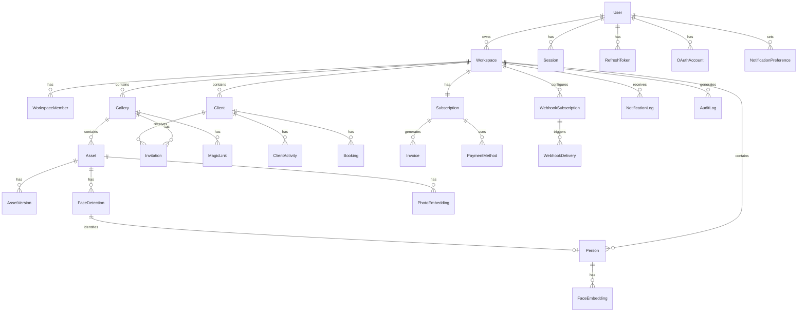

# RawDrive Data Model - Complete Schema

**Version:** 2.0.0 | **Last Updated:** January 2026

This document defines the complete database schema for the RawDrive platform, including SQLAlchemy models, relationships, constraints, and multi-tenancy rules.

---

## Table of Contents

1. [Schema Overview](#schema-overview)
2. [Core Entities](#core-entities)
3. [Authentication & Sessions](#authentication--sessions)
4. [Workspace & Multi-Tenancy](#workspace--multi-tenancy)
5. [Gallery & Assets](#gallery--assets)
6. [AI & Face Recognition](#ai--face-recognition)
7. [Business Entities](#business-entities)
8. [Notifications & Webhooks](#notifications--webhooks)
9. [Audit & Compliance](#audit--compliance)
10. [Indexes & Performance](#indexes--performance)
11. [Migration Strategy](#migration-strategy)

---

## Schema Overview

### Entity Relationship Diagram



### Database Extensions

```sql
-- Required PostgreSQL extensions
CREATE EXTENSION IF NOT EXISTS "uuid-ossp";      -- UUID generation
CREATE EXTENSION IF NOT EXISTS "pgcrypto";       -- Cryptographic functions
CREATE EXTENSION IF NOT EXISTS "vector";         -- pgvector for embeddings
CREATE EXTENSION IF NOT EXISTS "pg_trgm";        -- Trigram similarity search
```

---

## Core Entities

### Base Model

All models inherit from this base class for common functionality:

```python
# backend/src/app/models/base.py
from datetime import datetime
from typing import Optional
from uuid import UUID, uuid4
from sqlalchemy import Column, DateTime, Boolean
from sqlalchemy.dialects.postgresql import UUID as PG_UUID
from sqlalchemy.orm import DeclarativeBase, Mapped, mapped_column

class Base(DeclarativeBase):
    pass

class TimestampMixin:
    created_at: Mapped[datetime] = mapped_column(
        DateTime(timezone=True),
        default=datetime.utcnow,
        nullable=False
    )
    updated_at: Mapped[datetime] = mapped_column(
        DateTime(timezone=True),
        default=datetime.utcnow,
        onupdate=datetime.utcnow,
        nullable=False
    )

class SoftDeleteMixin:
    deleted_at: Mapped[Optional[datetime]] = mapped_column(
        DateTime(timezone=True),
        nullable=True,
        default=None
    )

    @property
    def is_deleted(self) -> bool:
        return self.deleted_at is not None

class WorkspaceScopedMixin:
    """All workspace-scoped entities must include workspace_id."""
    workspace_id: Mapped[UUID] = mapped_column(
        PG_UUID(as_uuid=True),
        nullable=False,
        index=True
    )
```

### User Model

```python
# backend/src/app/models/user.py
from enum import Enum
from sqlalchemy import String, Enum as SQLEnum, Index
from sqlalchemy.orm import relationship

class UserStatus(str, Enum):
    ACTIVE = "active"
    SUSPENDED = "suspended"
    PENDING_VERIFICATION = "pending_verification"

class User(Base, TimestampMixin, SoftDeleteMixin):
    __tablename__ = "users"

    id: Mapped[UUID] = mapped_column(
        PG_UUID(as_uuid=True),
        primary_key=True,
        default=uuid4
    )
    email: Mapped[str] = mapped_column(String(255), unique=True, nullable=False)
    email_verified: Mapped[bool] = mapped_column(default=False)
    password_hash: Mapped[Optional[str]] = mapped_column(String(255), nullable=True)

    # Profile
    first_name: Mapped[str] = mapped_column(String(100), nullable=False)
    last_name: Mapped[str] = mapped_column(String(100), nullable=False)
    display_name: Mapped[Optional[str]] = mapped_column(String(200), nullable=True)
    avatar_url: Mapped[Optional[str]] = mapped_column(String(500), nullable=True)
    bio: Mapped[Optional[str]] = mapped_column(String(1000), nullable=True)
    phone: Mapped[Optional[str]] = mapped_column(String(20), nullable=True)

    # Status
    status: Mapped[UserStatus] = mapped_column(
        SQLEnum(UserStatus),
        default=UserStatus.PENDING_VERIFICATION
    )

    # MFA
    mfa_enabled: Mapped[bool] = mapped_column(default=False)
    mfa_secret: Mapped[Optional[str]] = mapped_column(String(32), nullable=True)

    # Relationships
    workspaces = relationship("Workspace", back_populates="owner", cascade="all, delete-orphan")
    sessions = relationship("Session", back_populates="user", cascade="all, delete-orphan")
    refresh_tokens = relationship("RefreshToken", back_populates="user", cascade="all, delete-orphan")
    oauth_accounts = relationship("OAuthAccount", back_populates="user", cascade="all, delete-orphan")
    notification_preferences = relationship("NotificationPreference", back_populates="user")

    __table_args__ = (
        Index("idx_user_email_lower", "email", postgresql_using="btree"),
        Index("idx_user_status", "status"),
    )

    @property
    def full_name(self) -> str:
        return f"{self.first_name} {self.last_name}"
```

**SQL Definition:**
```sql
CREATE TABLE users (
    id UUID PRIMARY KEY DEFAULT uuid_generate_v4(),
    email VARCHAR(255) NOT NULL UNIQUE,
    email_verified BOOLEAN DEFAULT FALSE,
    password_hash VARCHAR(255),

    first_name VARCHAR(100) NOT NULL,
    last_name VARCHAR(100) NOT NULL,
    display_name VARCHAR(200),
    avatar_url VARCHAR(500),
    bio VARCHAR(1000),
    phone VARCHAR(20),

    status VARCHAR(50) DEFAULT 'pending_verification',

    mfa_enabled BOOLEAN DEFAULT FALSE,
    mfa_secret VARCHAR(32),

    created_at TIMESTAMP WITH TIME ZONE DEFAULT NOW(),
    updated_at TIMESTAMP WITH TIME ZONE DEFAULT NOW(),
    deleted_at TIMESTAMP WITH TIME ZONE
);

CREATE INDEX idx_user_email_lower ON users (LOWER(email));
CREATE INDEX idx_user_status ON users (status);
```

---

## Authentication & Sessions

### RefreshToken Model

```python
# backend/src/app/models/auth.py
from sqlalchemy import String, ForeignKey, Index

class RefreshToken(Base, TimestampMixin):
    __tablename__ = "refresh_tokens"

    id: Mapped[UUID] = mapped_column(
        PG_UUID(as_uuid=True),
        primary_key=True,
        default=uuid4
    )
    user_id: Mapped[UUID] = mapped_column(
        PG_UUID(as_uuid=True),
        ForeignKey("users.id", ondelete="CASCADE"),
        nullable=False
    )
    token_hash: Mapped[str] = mapped_column(String(64), unique=True, nullable=False)

    # Device info
    device_name: Mapped[Optional[str]] = mapped_column(String(200), nullable=True)
    device_type: Mapped[Optional[str]] = mapped_column(String(50), nullable=True)
    ip_address: Mapped[Optional[str]] = mapped_column(String(45), nullable=True)
    user_agent: Mapped[Optional[str]] = mapped_column(String(500), nullable=True)

    # Expiration
    expires_at: Mapped[datetime] = mapped_column(DateTime(timezone=True), nullable=False)
    revoked_at: Mapped[Optional[datetime]] = mapped_column(DateTime(timezone=True), nullable=True)

    # Relationships
    user = relationship("User", back_populates="refresh_tokens")

    __table_args__ = (
        Index("idx_refresh_token_user_id", "user_id"),
        Index("idx_refresh_token_hash", "token_hash"),
        Index("idx_refresh_token_expires", "expires_at"),
    )

    @property
    def is_valid(self) -> bool:
        return self.revoked_at is None and self.expires_at > datetime.utcnow()
```

### Session Model

```python
class Session(Base, TimestampMixin):
    __tablename__ = "sessions"

    id: Mapped[UUID] = mapped_column(
        PG_UUID(as_uuid=True),
        primary_key=True,
        default=uuid4
    )
    user_id: Mapped[UUID] = mapped_column(
        PG_UUID(as_uuid=True),
        ForeignKey("users.id", ondelete="CASCADE"),
        nullable=False
    )
    workspace_id: Mapped[Optional[UUID]] = mapped_column(
        PG_UUID(as_uuid=True),
        ForeignKey("workspaces.id", ondelete="SET NULL"),
        nullable=True
    )

    # Session data
    ip_address: Mapped[str] = mapped_column(String(45), nullable=False)
    user_agent: Mapped[str] = mapped_column(String(500), nullable=False)
    last_active_at: Mapped[datetime] = mapped_column(
        DateTime(timezone=True),
        default=datetime.utcnow,
        nullable=False
    )

    # Expiration
    expires_at: Mapped[datetime] = mapped_column(DateTime(timezone=True), nullable=False)

    # Relationships
    user = relationship("User", back_populates="sessions")

    __table_args__ = (
        Index("idx_session_user_id", "user_id"),
        Index("idx_session_expires", "expires_at"),
    )
```

### OAuthAccount Model

```python
class OAuthProvider(str, Enum):
    GOOGLE = "google"
    GITHUB = "github"
    FACEBOOK = "facebook"
    MICROSOFT = "microsoft"

class OAuthAccount(Base, TimestampMixin):
    __tablename__ = "oauth_accounts"

    id: Mapped[UUID] = mapped_column(
        PG_UUID(as_uuid=True),
        primary_key=True,
        default=uuid4
    )
    user_id: Mapped[UUID] = mapped_column(
        PG_UUID(as_uuid=True),
        ForeignKey("users.id", ondelete="CASCADE"),
        nullable=False
    )
    provider: Mapped[OAuthProvider] = mapped_column(SQLEnum(OAuthProvider), nullable=False)
    provider_user_id: Mapped[str] = mapped_column(String(255), nullable=False)
    provider_email: Mapped[Optional[str]] = mapped_column(String(255), nullable=True)

    # Tokens (encrypted)
    access_token: Mapped[Optional[str]] = mapped_column(String(2000), nullable=True)
    refresh_token: Mapped[Optional[str]] = mapped_column(String(2000), nullable=True)
    token_expires_at: Mapped[Optional[datetime]] = mapped_column(DateTime(timezone=True), nullable=True)

    # Relationships
    user = relationship("User", back_populates="oauth_accounts")

    __table_args__ = (
        Index("idx_oauth_provider_user", "provider", "provider_user_id", unique=True),
        Index("idx_oauth_user_id", "user_id"),
    )
```

---

## Workspace & Multi-Tenancy

### Workspace Model

```python
# backend/src/app/models/workspace.py
from sqlalchemy import String, ForeignKey, JSON
from sqlalchemy.orm import relationship

class Workspace(Base, TimestampMixin, SoftDeleteMixin):
    __tablename__ = "workspaces"

    id: Mapped[UUID] = mapped_column(
        PG_UUID(as_uuid=True),
        primary_key=True,
        default=uuid4
    )
    owner_id: Mapped[UUID] = mapped_column(
        PG_UUID(as_uuid=True),
        ForeignKey("users.id", ondelete="CASCADE"),
        nullable=False
    )
    name: Mapped[str] = mapped_column(String(200), nullable=False)
    slug: Mapped[str] = mapped_column(String(100), unique=True, nullable=False)

    # Settings
    settings: Mapped[dict] = mapped_column(JSON, default=dict)
    # Expected structure:
    # {
    #   "timezone": "UTC",
    #   "language": "en",
    #   "currency": "USD",
    #   "date_format": "YYYY-MM-DD",
    #   "branding": {
    #     "logo_url": "...",
    #     "primary_color": "#000000",
    #     "accent_color": "#0066FF"
    #   }
    # }

    # Quota tracking
    storage_used_bytes: Mapped[int] = mapped_column(default=0)
    asset_count: Mapped[int] = mapped_column(default=0)
    gallery_count: Mapped[int] = mapped_column(default=0)

    # Relationships
    owner = relationship("User", back_populates="workspaces")
    members = relationship("WorkspaceMember", back_populates="workspace", cascade="all, delete-orphan")
    subscription = relationship("Subscription", back_populates="workspace", uselist=False)
    galleries = relationship("Gallery", back_populates="workspace", cascade="all, delete-orphan")
    clients = relationship("Client", back_populates="workspace", cascade="all, delete-orphan")
    people = relationship("Person", back_populates="workspace", cascade="all, delete-orphan")
    webhook_subscriptions = relationship("WebhookSubscription", back_populates="workspace")
    audit_logs = relationship("AuditLog", back_populates="workspace")

    __table_args__ = (
        Index("idx_workspace_owner", "owner_id"),
        Index("idx_workspace_slug", "slug"),
    )
```

### WorkspaceMember Model

```python
class WorkspaceRole(str, Enum):
    OWNER = "owner"
    ADMIN = "admin"
    EDITOR = "editor"
    VIEWER = "viewer"

class WorkspaceMember(Base, TimestampMixin):
    __tablename__ = "workspace_members"

    id: Mapped[UUID] = mapped_column(
        PG_UUID(as_uuid=True),
        primary_key=True,
        default=uuid4
    )
    workspace_id: Mapped[UUID] = mapped_column(
        PG_UUID(as_uuid=True),
        ForeignKey("workspaces.id", ondelete="CASCADE"),
        nullable=False
    )
    user_id: Mapped[UUID] = mapped_column(
        PG_UUID(as_uuid=True),
        ForeignKey("users.id", ondelete="CASCADE"),
        nullable=False
    )
    role: Mapped[WorkspaceRole] = mapped_column(
        SQLEnum(WorkspaceRole),
        default=WorkspaceRole.VIEWER
    )

    # Relationships
    workspace = relationship("Workspace", back_populates="members")
    user = relationship("User")

    __table_args__ = (
        Index("idx_workspace_member_unique", "workspace_id", "user_id", unique=True),
    )
```

### WorkspaceInvite Model

```python
class WorkspaceInvite(Base, TimestampMixin):
    __tablename__ = "workspace_invites"

    id: Mapped[UUID] = mapped_column(
        PG_UUID(as_uuid=True),
        primary_key=True,
        default=uuid4
    )
    workspace_id: Mapped[UUID] = mapped_column(
        PG_UUID(as_uuid=True),
        ForeignKey("workspaces.id", ondelete="CASCADE"),
        nullable=False
    )
    email: Mapped[str] = mapped_column(String(255), nullable=False)
    role: Mapped[WorkspaceRole] = mapped_column(SQLEnum(WorkspaceRole), nullable=False)
    invited_by_id: Mapped[UUID] = mapped_column(
        PG_UUID(as_uuid=True),
        ForeignKey("users.id"),
        nullable=False
    )

    # Token
    token: Mapped[str] = mapped_column(String(64), unique=True, nullable=False)
    expires_at: Mapped[datetime] = mapped_column(DateTime(timezone=True), nullable=False)

    # Status
    accepted_at: Mapped[Optional[datetime]] = mapped_column(DateTime(timezone=True), nullable=True)

    __table_args__ = (
        Index("idx_workspace_invite_token", "token"),
        Index("idx_workspace_invite_email", "workspace_id", "email"),
    )
```

---

## Gallery & Assets

### Gallery Model

```python
# backend/src/app/models/gallery.py
from sqlalchemy import String, ForeignKey, Boolean, Integer, JSON
from sqlalchemy.orm import relationship

class GalleryStatus(str, Enum):
    DRAFT = "draft"
    PUBLISHED = "published"
    ARCHIVED = "archived"

class Gallery(Base, TimestampMixin, SoftDeleteMixin, WorkspaceScopedMixin):
    __tablename__ = "galleries"

    id: Mapped[UUID] = mapped_column(
        PG_UUID(as_uuid=True),
        primary_key=True,
        default=uuid4
    )
    name: Mapped[str] = mapped_column(String(255), nullable=False)
    slug: Mapped[str] = mapped_column(String(100), nullable=False)
    description: Mapped[Optional[str]] = mapped_column(String(2000), nullable=True)

    # Status
    status: Mapped[GalleryStatus] = mapped_column(
        SQLEnum(GalleryStatus),
        default=GalleryStatus.DRAFT
    )
    is_public: Mapped[bool] = mapped_column(default=False)

    # Cover
    cover_asset_id: Mapped[Optional[UUID]] = mapped_column(
        PG_UUID(as_uuid=True),
        ForeignKey("assets.id", ondelete="SET NULL"),
        nullable=True
    )

    # Event metadata
    event_date: Mapped[Optional[datetime]] = mapped_column(DateTime(timezone=True), nullable=True)
    event_type: Mapped[Optional[str]] = mapped_column(String(100), nullable=True)
    location: Mapped[Optional[str]] = mapped_column(String(500), nullable=True)

    # Settings
    settings: Mapped[dict] = mapped_column(JSON, default=dict)
    # {
    #   "download_enabled": true,
    #   "selection_enabled": true,
    #   "watermark_enabled": false,
    #   "password_protected": false,
    #   "max_selections": 100
    # }

    # Counters
    asset_count: Mapped[int] = mapped_column(default=0)
    view_count: Mapped[int] = mapped_column(default=0)

    # Timestamps
    published_at: Mapped[Optional[datetime]] = mapped_column(DateTime(timezone=True), nullable=True)

    # Relationships
    workspace = relationship("Workspace", back_populates="galleries")
    assets = relationship("Asset", back_populates="gallery", cascade="all, delete-orphan")
    invitations = relationship("Invitation", back_populates="gallery", cascade="all, delete-orphan")
    magic_links = relationship("MagicLink", back_populates="gallery", cascade="all, delete-orphan")

    __table_args__ = (
        Index("idx_gallery_workspace", "workspace_id"),
        Index("idx_gallery_slug", "workspace_id", "slug", unique=True),
        Index("idx_gallery_status", "status"),
        Index("idx_gallery_public", "is_public", "status"),
    )
```

### Asset Model

```python
class AssetType(str, Enum):
    IMAGE = "image"
    VIDEO = "video"
    RAW = "raw"

class AssetStatus(str, Enum):
    UPLOADING = "uploading"
    PROCESSING = "processing"
    READY = "ready"
    FAILED = "failed"
    ARCHIVED = "archived"

class Asset(Base, TimestampMixin, SoftDeleteMixin, WorkspaceScopedMixin):
    __tablename__ = "assets"

    id: Mapped[UUID] = mapped_column(
        PG_UUID(as_uuid=True),
        primary_key=True,
        default=uuid4
    )
    gallery_id: Mapped[UUID] = mapped_column(
        PG_UUID(as_uuid=True),
        ForeignKey("galleries.id", ondelete="CASCADE"),
        nullable=False
    )

    # File info
    file_name: Mapped[str] = mapped_column(String(255), nullable=False)
    file_size: Mapped[int] = mapped_column(nullable=False)
    mime_type: Mapped[str] = mapped_column(String(100), nullable=False)
    asset_type: Mapped[AssetType] = mapped_column(SQLEnum(AssetType), nullable=False)

    # Storage
    storage_key: Mapped[str] = mapped_column(String(500), nullable=False)
    encrypted_data_key: Mapped[Optional[bytes]] = mapped_column(nullable=True)

    # URLs (signed, short-lived)
    original_url: Mapped[Optional[str]] = mapped_column(String(2000), nullable=True)
    thumbnail_url: Mapped[Optional[str]] = mapped_column(String(2000), nullable=True)

    # Dimensions
    width: Mapped[Optional[int]] = mapped_column(nullable=True)
    height: Mapped[Optional[int]] = mapped_column(nullable=True)
    orientation: Mapped[Optional[str]] = mapped_column(String(20), nullable=True)
    duration_seconds: Mapped[Optional[float]] = mapped_column(nullable=True)  # For video

    # EXIF data
    exif_data: Mapped[Optional[dict]] = mapped_column(JSON, nullable=True)
    # {
    #   "camera": "Canon EOS R5",
    #   "lens": "RF 24-70mm F2.8",
    #   "iso": 400,
    #   "aperture": "f/2.8",
    #   "shutter_speed": "1/200",
    #   "focal_length": "50mm",
    #   "date_time": "2026-01-13T10:30:00Z",
    #   "gps": { "lat": 37.7749, "lng": -122.4194 }
    # }

    # AI analysis
    ai_tags: Mapped[Optional[list]] = mapped_column(JSON, nullable=True)
    ai_description: Mapped[Optional[str]] = mapped_column(String(1000), nullable=True)
    ai_quality_score: Mapped[Optional[float]] = mapped_column(nullable=True)

    # Status
    status: Mapped[AssetStatus] = mapped_column(
        SQLEnum(AssetStatus),
        default=AssetStatus.UPLOADING
    )

    # Selection
    is_selected: Mapped[bool] = mapped_column(default=False)
    is_favorite: Mapped[bool] = mapped_column(default=False)
    selected_at: Mapped[Optional[datetime]] = mapped_column(DateTime(timezone=True), nullable=True)

    # Ordering
    sort_order: Mapped[int] = mapped_column(default=0)

    # Relationships
    gallery = relationship("Gallery", back_populates="assets")
    versions = relationship("AssetVersion", back_populates="asset", cascade="all, delete-orphan")
    face_detections = relationship("FaceDetection", back_populates="asset", cascade="all, delete-orphan")
    embeddings = relationship("PhotoEmbedding", back_populates="asset", cascade="all, delete-orphan")

    __table_args__ = (
        Index("idx_asset_gallery", "gallery_id"),
        Index("idx_asset_workspace", "workspace_id"),
        Index("idx_asset_status", "status"),
        Index("idx_asset_type", "asset_type"),
        Index("idx_asset_selected", "gallery_id", "is_selected"),
        Index("idx_asset_sort", "gallery_id", "sort_order"),
    )
```

### AssetVersion Model

```python
class AssetVersion(Base, TimestampMixin):
    __tablename__ = "asset_versions"

    id: Mapped[UUID] = mapped_column(
        PG_UUID(as_uuid=True),
        primary_key=True,
        default=uuid4
    )
    asset_id: Mapped[UUID] = mapped_column(
        PG_UUID(as_uuid=True),
        ForeignKey("assets.id", ondelete="CASCADE"),
        nullable=False
    )
    version_type: Mapped[str] = mapped_column(String(50), nullable=False)
    # Types: original, thumbnail_xs, thumbnail_sm, thumbnail_md, thumbnail_lg, lqip, webp

    storage_key: Mapped[str] = mapped_column(String(500), nullable=False)
    file_size: Mapped[int] = mapped_column(nullable=False)
    width: Mapped[Optional[int]] = mapped_column(nullable=True)
    height: Mapped[Optional[int]] = mapped_column(nullable=True)

    # Relationships
    asset = relationship("Asset", back_populates="versions")

    __table_args__ = (
        Index("idx_asset_version_type", "asset_id", "version_type", unique=True),
    )
```

### MagicLink Model

```python
class MagicLink(Base, TimestampMixin):
    __tablename__ = "magic_links"

    id: Mapped[UUID] = mapped_column(
        PG_UUID(as_uuid=True),
        primary_key=True,
        default=uuid4
    )
    gallery_id: Mapped[UUID] = mapped_column(
        PG_UUID(as_uuid=True),
        ForeignKey("galleries.id", ondelete="CASCADE"),
        nullable=False
    )
    workspace_id: Mapped[UUID] = mapped_column(
        PG_UUID(as_uuid=True),
        ForeignKey("workspaces.id", ondelete="CASCADE"),
        nullable=False
    )

    token: Mapped[str] = mapped_column(String(64), unique=True, nullable=False)
    access_level: Mapped[str] = mapped_column(String(20), nullable=False)  # view, select, download

    # Protection
    password_hash: Mapped[Optional[str]] = mapped_column(String(255), nullable=True)

    # Limits
    expires_at: Mapped[Optional[datetime]] = mapped_column(DateTime(timezone=True), nullable=True)
    max_views: Mapped[Optional[int]] = mapped_column(nullable=True)
    view_count: Mapped[int] = mapped_column(default=0)

    # Status
    is_active: Mapped[bool] = mapped_column(default=True)

    # Relationships
    gallery = relationship("Gallery", back_populates="magic_links")

    __table_args__ = (
        Index("idx_magic_link_token", "token"),
        Index("idx_magic_link_gallery", "gallery_id"),
    )
```

---

## AI & Face Recognition

### Person Model

```python
# backend/src/app/models/face.py
from pgvector.sqlalchemy import Vector

class Person(Base, TimestampMixin, SoftDeleteMixin, WorkspaceScopedMixin):
    __tablename__ = "people"

    id: Mapped[UUID] = mapped_column(
        PG_UUID(as_uuid=True),
        primary_key=True,
        default=uuid4
    )
    name: Mapped[str] = mapped_column(String(200), nullable=False)
    description: Mapped[Optional[str]] = mapped_column(String(1000), nullable=True)

    # Profile
    profile_photo_url: Mapped[Optional[str]] = mapped_column(String(2000), nullable=True)

    # Stats
    photo_count: Mapped[int] = mapped_column(default=0)

    # Contact info (optional, for client linking)
    email: Mapped[Optional[str]] = mapped_column(String(255), nullable=True)
    client_id: Mapped[Optional[UUID]] = mapped_column(
        PG_UUID(as_uuid=True),
        ForeignKey("clients.id", ondelete="SET NULL"),
        nullable=True
    )

    # Relationships
    workspace = relationship("Workspace", back_populates="people")
    face_embeddings = relationship("FaceEmbedding", back_populates="person", cascade="all, delete-orphan")
    face_detections = relationship("FaceDetection", back_populates="person")

    __table_args__ = (
        Index("idx_person_workspace", "workspace_id"),
        Index("idx_person_name", "workspace_id", "name"),
    )
```

### FaceDetection Model

```python
class FaceDetection(Base, TimestampMixin):
    __tablename__ = "face_detections"

    id: Mapped[UUID] = mapped_column(
        PG_UUID(as_uuid=True),
        primary_key=True,
        default=uuid4
    )
    asset_id: Mapped[UUID] = mapped_column(
        PG_UUID(as_uuid=True),
        ForeignKey("assets.id", ondelete="CASCADE"),
        nullable=False
    )
    workspace_id: Mapped[UUID] = mapped_column(
        PG_UUID(as_uuid=True),
        ForeignKey("workspaces.id", ondelete="CASCADE"),
        nullable=False
    )
    person_id: Mapped[Optional[UUID]] = mapped_column(
        PG_UUID(as_uuid=True),
        ForeignKey("people.id", ondelete="SET NULL"),
        nullable=True
    )

    # Bounding box (normalized 0-1)
    bbox_x: Mapped[float] = mapped_column(nullable=False)
    bbox_y: Mapped[float] = mapped_column(nullable=False)
    bbox_width: Mapped[float] = mapped_column(nullable=False)
    bbox_height: Mapped[float] = mapped_column(nullable=False)

    # Detection metadata
    detection_confidence: Mapped[float] = mapped_column(nullable=False)
    recognition_confidence: Mapped[Optional[float]] = mapped_column(nullable=True)

    # Face attributes
    attributes: Mapped[Optional[dict]] = mapped_column(JSON, nullable=True)
    # {
    #   "joy_likelihood": "VERY_LIKELY",
    #   "roll_angle": -2.5,
    #   "pan_angle": 5.0,
    #   "tilt_angle": 0.0
    # }

    # Verification status
    is_verified: Mapped[bool] = mapped_column(default=False)
    verified_by_id: Mapped[Optional[UUID]] = mapped_column(
        PG_UUID(as_uuid=True),
        ForeignKey("users.id"),
        nullable=True
    )

    # Relationships
    asset = relationship("Asset", back_populates="face_detections")
    person = relationship("Person", back_populates="face_detections")

    __table_args__ = (
        Index("idx_face_detection_asset", "asset_id"),
        Index("idx_face_detection_person", "person_id"),
        Index("idx_face_detection_workspace", "workspace_id"),
    )
```

### FaceEmbedding Model

```python
class FaceEmbedding(Base, TimestampMixin):
    __tablename__ = "face_embeddings"

    id: Mapped[UUID] = mapped_column(
        PG_UUID(as_uuid=True),
        primary_key=True,
        default=uuid4
    )
    person_id: Mapped[UUID] = mapped_column(
        PG_UUID(as_uuid=True),
        ForeignKey("people.id", ondelete="CASCADE"),
        nullable=False
    )
    workspace_id: Mapped[UUID] = mapped_column(
        PG_UUID(as_uuid=True),
        ForeignKey("workspaces.id", ondelete="CASCADE"),
        nullable=False
    )
    face_detection_id: Mapped[UUID] = mapped_column(
        PG_UUID(as_uuid=True),
        ForeignKey("face_detections.id", ondelete="CASCADE"),
        nullable=False
    )

    # 512-dimensional ArcFace embedding
    embedding = mapped_column(Vector(512), nullable=False)

    # Quality score (used to select best embedding for person)
    quality_score: Mapped[float] = mapped_column(nullable=False)
    is_primary: Mapped[bool] = mapped_column(default=False)

    # Relationships
    person = relationship("Person", back_populates="face_embeddings")

    __table_args__ = (
        Index("idx_face_embedding_person", "person_id"),
        Index("idx_face_embedding_workspace", "workspace_id"),
        Index(
            "idx_face_embedding_vector",
            "embedding",
            postgresql_using="ivfflat",
            postgresql_with={"lists": 100},
            postgresql_ops={"embedding": "vector_cosine_ops"}
        ),
    )
```

### PhotoEmbedding Model

```python
class PhotoEmbedding(Base, TimestampMixin):
    __tablename__ = "photo_embeddings"

    id: Mapped[UUID] = mapped_column(
        PG_UUID(as_uuid=True),
        primary_key=True,
        default=uuid4
    )
    asset_id: Mapped[UUID] = mapped_column(
        PG_UUID(as_uuid=True),
        ForeignKey("assets.id", ondelete="CASCADE"),
        nullable=False
    )
    workspace_id: Mapped[UUID] = mapped_column(
        PG_UUID(as_uuid=True),
        ForeignKey("workspaces.id", ondelete="CASCADE"),
        nullable=False
    )

    # Embedding model info
    model_name: Mapped[str] = mapped_column(String(100), nullable=False)
    model_version: Mapped[str] = mapped_column(String(50), nullable=False)

    # 1536-dimensional CLIP/text-embedding embedding
    embedding = mapped_column(Vector(1536), nullable=False)

    # Generated description/tags
    description: Mapped[Optional[str]] = mapped_column(String(1000), nullable=True)
    tags: Mapped[Optional[list]] = mapped_column(JSON, nullable=True)

    # Relationships
    asset = relationship("Asset", back_populates="embeddings")

    __table_args__ = (
        Index("idx_photo_embedding_asset", "asset_id"),
        Index("idx_photo_embedding_workspace", "workspace_id"),
        Index(
            "idx_photo_embedding_vector",
            "embedding",
            postgresql_using="ivfflat",
            postgresql_with={"lists": 100},
            postgresql_ops={"embedding": "vector_cosine_ops"}
        ),
    )
```

---

## Business Entities

### Client Model

```python
# backend/src/app/models/client.py

class Client(Base, TimestampMixin, SoftDeleteMixin, WorkspaceScopedMixin):
    __tablename__ = "clients"

    id: Mapped[UUID] = mapped_column(
        PG_UUID(as_uuid=True),
        primary_key=True,
        default=uuid4
    )

    # Contact info
    email: Mapped[str] = mapped_column(String(255), nullable=False)
    first_name: Mapped[str] = mapped_column(String(100), nullable=False)
    last_name: Mapped[str] = mapped_column(String(100), nullable=False)
    phone: Mapped[Optional[str]] = mapped_column(String(20), nullable=True)

    # Address
    address: Mapped[Optional[dict]] = mapped_column(JSON, nullable=True)
    # {
    #   "street": "123 Main St",
    #   "city": "San Francisco",
    #   "state": "CA",
    #   "postal_code": "94102",
    #   "country": "US"
    # }

    # Social
    social_profiles: Mapped[Optional[dict]] = mapped_column(JSON, nullable=True)
    # {
    #   "instagram": "@username",
    #   "facebook": "https://facebook.com/...",
    #   "website": "https://..."
    # }

    # Project info
    project_type: Mapped[Optional[str]] = mapped_column(String(100), nullable=True)
    notes: Mapped[Optional[str]] = mapped_column(String(5000), nullable=True)
    tags: Mapped[Optional[list]] = mapped_column(JSON, nullable=True)

    # Stats
    gallery_count: Mapped[int] = mapped_column(default=0)
    total_spent: Mapped[float] = mapped_column(default=0.0)
    last_viewed_at: Mapped[Optional[datetime]] = mapped_column(DateTime(timezone=True), nullable=True)

    # Relationships
    workspace = relationship("Workspace", back_populates="clients")
    activities = relationship("ClientActivity", back_populates="client", cascade="all, delete-orphan")
    bookings = relationship("Booking", back_populates="client")
    invitations = relationship("Invitation", back_populates="client")

    __table_args__ = (
        Index("idx_client_workspace", "workspace_id"),
        Index("idx_client_email", "workspace_id", "email"),
        Index("idx_client_name", "workspace_id", "last_name", "first_name"),
    )

    @property
    def full_name(self) -> str:
        return f"{self.first_name} {self.last_name}"
```

### ClientActivity Model

```python
class ClientActivityType(str, Enum):
    GALLERY_VIEWED = "gallery_viewed"
    PHOTO_VIEWED = "photo_viewed"
    PHOTO_SELECTED = "photo_selected"
    PHOTO_DOWNLOADED = "photo_downloaded"
    SELECTION_SUBMITTED = "selection_submitted"
    COMMENT_ADDED = "comment_added"

class ClientActivity(Base, TimestampMixin):
    __tablename__ = "client_activities"

    id: Mapped[UUID] = mapped_column(
        PG_UUID(as_uuid=True),
        primary_key=True,
        default=uuid4
    )
    client_id: Mapped[UUID] = mapped_column(
        PG_UUID(as_uuid=True),
        ForeignKey("clients.id", ondelete="CASCADE"),
        nullable=False
    )
    workspace_id: Mapped[UUID] = mapped_column(
        PG_UUID(as_uuid=True),
        ForeignKey("workspaces.id", ondelete="CASCADE"),
        nullable=False
    )

    activity_type: Mapped[ClientActivityType] = mapped_column(SQLEnum(ClientActivityType), nullable=False)

    # Reference
    gallery_id: Mapped[Optional[UUID]] = mapped_column(
        PG_UUID(as_uuid=True),
        ForeignKey("galleries.id", ondelete="SET NULL"),
        nullable=True
    )
    asset_id: Mapped[Optional[UUID]] = mapped_column(
        PG_UUID(as_uuid=True),
        ForeignKey("assets.id", ondelete="SET NULL"),
        nullable=True
    )

    # Metadata
    metadata: Mapped[Optional[dict]] = mapped_column(JSON, nullable=True)
    ip_address: Mapped[Optional[str]] = mapped_column(String(45), nullable=True)
    user_agent: Mapped[Optional[str]] = mapped_column(String(500), nullable=True)

    # Relationships
    client = relationship("Client", back_populates="activities")

    __table_args__ = (
        Index("idx_client_activity_client", "client_id"),
        Index("idx_client_activity_workspace", "workspace_id"),
        Index("idx_client_activity_type", "activity_type"),
        Index("idx_client_activity_created", "created_at"),
    )
```

### Booking Model

```python
class BookingStatus(str, Enum):
    INQUIRY = "inquiry"
    QUOTED = "quoted"
    CONFIRMED = "confirmed"
    COMPLETED = "completed"
    CANCELLED = "cancelled"

class Booking(Base, TimestampMixin, SoftDeleteMixin, WorkspaceScopedMixin):
    __tablename__ = "bookings"

    id: Mapped[UUID] = mapped_column(
        PG_UUID(as_uuid=True),
        primary_key=True,
        default=uuid4
    )
    client_id: Mapped[Optional[UUID]] = mapped_column(
        PG_UUID(as_uuid=True),
        ForeignKey("clients.id", ondelete="SET NULL"),
        nullable=True
    )

    # Client info (denormalized for when client is deleted)
    client_name: Mapped[str] = mapped_column(String(200), nullable=False)
    client_email: Mapped[str] = mapped_column(String(255), nullable=False)
    client_phone: Mapped[Optional[str]] = mapped_column(String(20), nullable=True)

    # Service details
    service_type: Mapped[str] = mapped_column(String(100), nullable=False)
    event_date: Mapped[datetime] = mapped_column(DateTime(timezone=True), nullable=False)
    event_time: Mapped[Optional[str]] = mapped_column(String(50), nullable=True)
    event_location: Mapped[Optional[str]] = mapped_column(String(500), nullable=True)
    duration_hours: Mapped[Optional[float]] = mapped_column(nullable=True)
    description: Mapped[Optional[str]] = mapped_column(String(5000), nullable=True)

    # Status
    status: Mapped[BookingStatus] = mapped_column(
        SQLEnum(BookingStatus),
        default=BookingStatus.INQUIRY
    )

    # Pricing
    quote_amount: Mapped[Optional[float]] = mapped_column(nullable=True)
    deposit_amount: Mapped[Optional[float]] = mapped_column(nullable=True)
    deposit_paid: Mapped[bool] = mapped_column(default=False)
    total_amount: Mapped[Optional[float]] = mapped_column(nullable=True)
    currency: Mapped[str] = mapped_column(String(3), default="USD")

    # Timestamps
    quoted_at: Mapped[Optional[datetime]] = mapped_column(DateTime(timezone=True), nullable=True)
    confirmed_at: Mapped[Optional[datetime]] = mapped_column(DateTime(timezone=True), nullable=True)
    completed_at: Mapped[Optional[datetime]] = mapped_column(DateTime(timezone=True), nullable=True)

    # Relationships
    workspace = relationship("Workspace")
    client = relationship("Client", back_populates="bookings")

    __table_args__ = (
        Index("idx_booking_workspace", "workspace_id"),
        Index("idx_booking_client", "client_id"),
        Index("idx_booking_status", "status"),
        Index("idx_booking_event_date", "event_date"),
    )
```

### Subscription Model

```python
# backend/src/app/models/billing.py

class SubscriptionTier(str, Enum):
    FREE = "free"
    STARTER = "starter"
    PROFESSIONAL = "professional"
    BUSINESS = "business"
    ENTERPRISE = "enterprise"

class SubscriptionStatus(str, Enum):
    ACTIVE = "active"
    TRIAL = "trial"
    PAST_DUE = "past_due"
    CANCELLED = "cancelled"
    EXPIRED = "expired"

class Subscription(Base, TimestampMixin):
    __tablename__ = "subscriptions"

    id: Mapped[UUID] = mapped_column(
        PG_UUID(as_uuid=True),
        primary_key=True,
        default=uuid4
    )
    workspace_id: Mapped[UUID] = mapped_column(
        PG_UUID(as_uuid=True),
        ForeignKey("workspaces.id", ondelete="CASCADE"),
        unique=True,
        nullable=False
    )

    # Plan
    tier: Mapped[SubscriptionTier] = mapped_column(
        SQLEnum(SubscriptionTier),
        default=SubscriptionTier.FREE
    )
    billing_cycle: Mapped[str] = mapped_column(String(20), default="monthly")  # monthly, annual

    # Pricing
    price_amount: Mapped[float] = mapped_column(default=0.0)
    currency: Mapped[str] = mapped_column(String(3), default="USD")

    # Status
    status: Mapped[SubscriptionStatus] = mapped_column(
        SQLEnum(SubscriptionStatus),
        default=SubscriptionStatus.TRIAL
    )

    # Dates
    trial_ends_at: Mapped[Optional[datetime]] = mapped_column(DateTime(timezone=True), nullable=True)
    current_period_start: Mapped[Optional[datetime]] = mapped_column(DateTime(timezone=True), nullable=True)
    current_period_end: Mapped[Optional[datetime]] = mapped_column(DateTime(timezone=True), nullable=True)
    cancelled_at: Mapped[Optional[datetime]] = mapped_column(DateTime(timezone=True), nullable=True)

    # Payment provider
    stripe_customer_id: Mapped[Optional[str]] = mapped_column(String(255), nullable=True)
    stripe_subscription_id: Mapped[Optional[str]] = mapped_column(String(255), nullable=True)
    razorpay_subscription_id: Mapped[Optional[str]] = mapped_column(String(255), nullable=True)

    # Relationships
    workspace = relationship("Workspace", back_populates="subscription")
    invoices = relationship("Invoice", back_populates="subscription")
    payment_methods = relationship("PaymentMethod", back_populates="subscription")

    __table_args__ = (
        Index("idx_subscription_workspace", "workspace_id"),
        Index("idx_subscription_status", "status"),
        Index("idx_subscription_stripe", "stripe_customer_id"),
    )
```

### Invoice Model

```python
class InvoiceStatus(str, Enum):
    DRAFT = "draft"
    OPEN = "open"
    PAID = "paid"
    VOID = "void"
    UNCOLLECTIBLE = "uncollectible"

class Invoice(Base, TimestampMixin):
    __tablename__ = "invoices"

    id: Mapped[UUID] = mapped_column(
        PG_UUID(as_uuid=True),
        primary_key=True,
        default=uuid4
    )
    subscription_id: Mapped[UUID] = mapped_column(
        PG_UUID(as_uuid=True),
        ForeignKey("subscriptions.id", ondelete="CASCADE"),
        nullable=False
    )
    workspace_id: Mapped[UUID] = mapped_column(
        PG_UUID(as_uuid=True),
        ForeignKey("workspaces.id", ondelete="CASCADE"),
        nullable=False
    )

    # Invoice details
    invoice_number: Mapped[str] = mapped_column(String(50), unique=True, nullable=False)
    amount: Mapped[float] = mapped_column(nullable=False)
    tax_amount: Mapped[float] = mapped_column(default=0.0)
    total_amount: Mapped[float] = mapped_column(nullable=False)
    currency: Mapped[str] = mapped_column(String(3), default="USD")

    # Status
    status: Mapped[InvoiceStatus] = mapped_column(
        SQLEnum(InvoiceStatus),
        default=InvoiceStatus.DRAFT
    )

    # Dates
    due_date: Mapped[datetime] = mapped_column(DateTime(timezone=True), nullable=False)
    paid_at: Mapped[Optional[datetime]] = mapped_column(DateTime(timezone=True), nullable=True)

    # Payment provider
    stripe_invoice_id: Mapped[Optional[str]] = mapped_column(String(255), nullable=True)
    payment_intent_id: Mapped[Optional[str]] = mapped_column(String(255), nullable=True)

    # PDF
    pdf_url: Mapped[Optional[str]] = mapped_column(String(2000), nullable=True)

    # Relationships
    subscription = relationship("Subscription", back_populates="invoices")

    __table_args__ = (
        Index("idx_invoice_subscription", "subscription_id"),
        Index("idx_invoice_workspace", "workspace_id"),
        Index("idx_invoice_status", "status"),
        Index("idx_invoice_number", "invoice_number"),
    )
```

### PaymentMethod Model

```python
class PaymentMethod(Base, TimestampMixin):
    __tablename__ = "payment_methods"

    id: Mapped[UUID] = mapped_column(
        PG_UUID(as_uuid=True),
        primary_key=True,
        default=uuid4
    )
    subscription_id: Mapped[UUID] = mapped_column(
        PG_UUID(as_uuid=True),
        ForeignKey("subscriptions.id", ondelete="CASCADE"),
        nullable=False
    )

    # Type
    type: Mapped[str] = mapped_column(String(50), nullable=False)  # card, bank_account, upi

    # Card details (masked)
    card_brand: Mapped[Optional[str]] = mapped_column(String(50), nullable=True)
    card_last4: Mapped[Optional[str]] = mapped_column(String(4), nullable=True)
    card_exp_month: Mapped[Optional[int]] = mapped_column(nullable=True)
    card_exp_year: Mapped[Optional[int]] = mapped_column(nullable=True)

    # Status
    is_default: Mapped[bool] = mapped_column(default=False)

    # Provider
    stripe_payment_method_id: Mapped[Optional[str]] = mapped_column(String(255), nullable=True)

    # Relationships
    subscription = relationship("Subscription", back_populates="payment_methods")

    __table_args__ = (
        Index("idx_payment_method_subscription", "subscription_id"),
    )
```

### Invitation Model

```python
class InvitationStatus(str, Enum):
    PENDING = "pending"
    VIEWED = "viewed"
    ACCEPTED = "accepted"
    EXPIRED = "expired"

class Invitation(Base, TimestampMixin):
    __tablename__ = "invitations"

    id: Mapped[UUID] = mapped_column(
        PG_UUID(as_uuid=True),
        primary_key=True,
        default=uuid4
    )
    gallery_id: Mapped[UUID] = mapped_column(
        PG_UUID(as_uuid=True),
        ForeignKey("galleries.id", ondelete="CASCADE"),
        nullable=False
    )
    workspace_id: Mapped[UUID] = mapped_column(
        PG_UUID(as_uuid=True),
        ForeignKey("workspaces.id", ondelete="CASCADE"),
        nullable=False
    )
    client_id: Mapped[Optional[UUID]] = mapped_column(
        PG_UUID(as_uuid=True),
        ForeignKey("clients.id", ondelete="SET NULL"),
        nullable=True
    )

    # Recipient
    email: Mapped[str] = mapped_column(String(255), nullable=False)
    recipient_name: Mapped[Optional[str]] = mapped_column(String(200), nullable=True)

    # Access
    access_level: Mapped[str] = mapped_column(String(20), default="view")  # view, select, download

    # Message
    personal_message: Mapped[Optional[str]] = mapped_column(String(2000), nullable=True)

    # Status
    status: Mapped[InvitationStatus] = mapped_column(
        SQLEnum(InvitationStatus),
        default=InvitationStatus.PENDING
    )

    # Expiration
    expires_at: Mapped[Optional[datetime]] = mapped_column(DateTime(timezone=True), nullable=True)

    # Tracking
    sent_at: Mapped[Optional[datetime]] = mapped_column(DateTime(timezone=True), nullable=True)
    viewed_at: Mapped[Optional[datetime]] = mapped_column(DateTime(timezone=True), nullable=True)
    accepted_at: Mapped[Optional[datetime]] = mapped_column(DateTime(timezone=True), nullable=True)

    # Relationships
    gallery = relationship("Gallery", back_populates="invitations")
    client = relationship("Client", back_populates="invitations")

    __table_args__ = (
        Index("idx_invitation_gallery", "gallery_id"),
        Index("idx_invitation_client", "client_id"),
        Index("idx_invitation_email", "email"),
        Index("idx_invitation_status", "status"),
    )
```

---

## Notifications & Webhooks

### NotificationPreference Model

```python
# backend/src/app/models/notification.py

class NotificationChannel(str, Enum):
    EMAIL = "email"
    PUSH = "push"
    IN_APP = "in_app"
    SMS = "sms"

class NotificationPreference(Base, TimestampMixin):
    __tablename__ = "notification_preferences"

    id: Mapped[UUID] = mapped_column(
        PG_UUID(as_uuid=True),
        primary_key=True,
        default=uuid4
    )
    user_id: Mapped[UUID] = mapped_column(
        PG_UUID(as_uuid=True),
        ForeignKey("users.id", ondelete="CASCADE"),
        nullable=False
    )

    # Preferences by category
    preferences: Mapped[dict] = mapped_column(JSON, default=dict)
    # {
    #   "gallery_viewed": {"email": true, "push": true, "in_app": true},
    #   "selection_complete": {"email": true, "push": true, "in_app": true},
    #   "payment_received": {"email": true, "push": false, "in_app": true},
    #   "marketing": {"email": false, "push": false}
    # }

    # Global settings
    email_enabled: Mapped[bool] = mapped_column(default=True)
    push_enabled: Mapped[bool] = mapped_column(default=True)
    quiet_hours_start: Mapped[Optional[str]] = mapped_column(String(5), nullable=True)  # "22:00"
    quiet_hours_end: Mapped[Optional[str]] = mapped_column(String(5), nullable=True)    # "08:00"
    timezone: Mapped[str] = mapped_column(String(50), default="UTC")

    # Relationships
    user = relationship("User", back_populates="notification_preferences")

    __table_args__ = (
        Index("idx_notification_pref_user", "user_id", unique=True),
    )
```

### NotificationLog Model

```python
class NotificationLog(Base, TimestampMixin):
    __tablename__ = "notification_logs"

    id: Mapped[UUID] = mapped_column(
        PG_UUID(as_uuid=True),
        primary_key=True,
        default=uuid4
    )
    workspace_id: Mapped[UUID] = mapped_column(
        PG_UUID(as_uuid=True),
        ForeignKey("workspaces.id", ondelete="CASCADE"),
        nullable=False
    )
    user_id: Mapped[Optional[UUID]] = mapped_column(
        PG_UUID(as_uuid=True),
        ForeignKey("users.id", ondelete="SET NULL"),
        nullable=True
    )

    # Notification details
    channel: Mapped[NotificationChannel] = mapped_column(SQLEnum(NotificationChannel), nullable=False)
    template_name: Mapped[str] = mapped_column(String(100), nullable=False)
    recipient: Mapped[str] = mapped_column(String(255), nullable=False)  # email or device token
    subject: Mapped[Optional[str]] = mapped_column(String(500), nullable=True)

    # Payload
    payload: Mapped[dict] = mapped_column(JSON, default=dict)

    # Status
    status: Mapped[str] = mapped_column(String(50), default="pending")  # pending, sent, delivered, failed
    sent_at: Mapped[Optional[datetime]] = mapped_column(DateTime(timezone=True), nullable=True)
    delivered_at: Mapped[Optional[datetime]] = mapped_column(DateTime(timezone=True), nullable=True)
    failed_at: Mapped[Optional[datetime]] = mapped_column(DateTime(timezone=True), nullable=True)
    failure_reason: Mapped[Optional[str]] = mapped_column(String(500), nullable=True)

    # Provider info
    provider_message_id: Mapped[Optional[str]] = mapped_column(String(255), nullable=True)

    __table_args__ = (
        Index("idx_notification_log_workspace", "workspace_id"),
        Index("idx_notification_log_user", "user_id"),
        Index("idx_notification_log_status", "status"),
        Index("idx_notification_log_created", "created_at"),
    )
```

### WebhookSubscription Model

```python
# backend/src/app/models/webhook.py

class WebhookSubscription(Base, TimestampMixin, SoftDeleteMixin):
    __tablename__ = "webhook_subscriptions"

    id: Mapped[UUID] = mapped_column(
        PG_UUID(as_uuid=True),
        primary_key=True,
        default=uuid4
    )
    workspace_id: Mapped[UUID] = mapped_column(
        PG_UUID(as_uuid=True),
        ForeignKey("workspaces.id", ondelete="CASCADE"),
        nullable=False
    )

    # Endpoint
    url: Mapped[str] = mapped_column(String(2000), nullable=False)
    description: Mapped[Optional[str]] = mapped_column(String(500), nullable=True)

    # Events to subscribe
    events: Mapped[list] = mapped_column(JSON, nullable=False)
    # ["gallery.created", "gallery.published", "asset.uploaded", "selection.complete"]

    # Authentication
    secret: Mapped[str] = mapped_column(String(64), nullable=False)

    # Status
    is_active: Mapped[bool] = mapped_column(default=True)

    # Stats
    total_deliveries: Mapped[int] = mapped_column(default=0)
    successful_deliveries: Mapped[int] = mapped_column(default=0)
    failed_deliveries: Mapped[int] = mapped_column(default=0)
    last_delivery_at: Mapped[Optional[datetime]] = mapped_column(DateTime(timezone=True), nullable=True)

    # Relationships
    workspace = relationship("Workspace", back_populates="webhook_subscriptions")
    deliveries = relationship("WebhookDelivery", back_populates="subscription", cascade="all, delete-orphan")

    __table_args__ = (
        Index("idx_webhook_sub_workspace", "workspace_id"),
        Index("idx_webhook_sub_active", "is_active"),
    )
```

### WebhookDelivery Model

```python
class WebhookDeliveryStatus(str, Enum):
    PENDING = "pending"
    SENDING = "sending"
    SUCCESS = "success"
    FAILED = "failed"
    RETRYING = "retrying"

class WebhookDelivery(Base, TimestampMixin):
    __tablename__ = "webhook_deliveries"

    id: Mapped[UUID] = mapped_column(
        PG_UUID(as_uuid=True),
        primary_key=True,
        default=uuid4
    )
    subscription_id: Mapped[UUID] = mapped_column(
        PG_UUID(as_uuid=True),
        ForeignKey("webhook_subscriptions.id", ondelete="CASCADE"),
        nullable=False
    )

    # Event
    event_type: Mapped[str] = mapped_column(String(100), nullable=False)
    event_id: Mapped[str] = mapped_column(String(50), nullable=False)
    payload: Mapped[dict] = mapped_column(JSON, nullable=False)

    # Delivery status
    status: Mapped[WebhookDeliveryStatus] = mapped_column(
        SQLEnum(WebhookDeliveryStatus),
        default=WebhookDeliveryStatus.PENDING
    )
    attempt_count: Mapped[int] = mapped_column(default=0)
    max_attempts: Mapped[int] = mapped_column(default=5)

    # Response
    response_status_code: Mapped[Optional[int]] = mapped_column(nullable=True)
    response_body: Mapped[Optional[str]] = mapped_column(String(5000), nullable=True)
    response_time_ms: Mapped[Optional[int]] = mapped_column(nullable=True)

    # Timestamps
    next_retry_at: Mapped[Optional[datetime]] = mapped_column(DateTime(timezone=True), nullable=True)
    delivered_at: Mapped[Optional[datetime]] = mapped_column(DateTime(timezone=True), nullable=True)

    # Error
    last_error: Mapped[Optional[str]] = mapped_column(String(1000), nullable=True)

    # Relationships
    subscription = relationship("WebhookSubscription", back_populates="deliveries")

    __table_args__ = (
        Index("idx_webhook_delivery_subscription", "subscription_id"),
        Index("idx_webhook_delivery_status", "status"),
        Index("idx_webhook_delivery_next_retry", "next_retry_at"),
        Index("idx_webhook_delivery_event", "event_type"),
    )
```

---

## Audit & Compliance

### AuditLog Model

```python
# backend/src/app/models/audit.py

class AuditLog(Base):
    __tablename__ = "audit_logs"

    id: Mapped[UUID] = mapped_column(
        PG_UUID(as_uuid=True),
        primary_key=True,
        default=uuid4
    )
    workspace_id: Mapped[UUID] = mapped_column(
        PG_UUID(as_uuid=True),
        ForeignKey("workspaces.id", ondelete="CASCADE"),
        nullable=False
    )
    user_id: Mapped[Optional[UUID]] = mapped_column(
        PG_UUID(as_uuid=True),
        ForeignKey("users.id", ondelete="SET NULL"),
        nullable=True
    )

    # Action
    action: Mapped[str] = mapped_column(String(100), nullable=False)
    # Examples: user.login, gallery.created, asset.deleted, settings.updated

    # Resource
    resource_type: Mapped[str] = mapped_column(String(50), nullable=False)
    resource_id: Mapped[Optional[UUID]] = mapped_column(PG_UUID(as_uuid=True), nullable=True)

    # Changes
    changes: Mapped[Optional[dict]] = mapped_column(JSON, nullable=True)
    # {
    #   "before": { "name": "Old Name" },
    #   "after": { "name": "New Name" }
    # }

    # Request context
    ip_address: Mapped[Optional[str]] = mapped_column(String(45), nullable=True)
    user_agent: Mapped[Optional[str]] = mapped_column(String(500), nullable=True)
    request_id: Mapped[Optional[str]] = mapped_column(String(50), nullable=True)

    # Timestamp
    timestamp: Mapped[datetime] = mapped_column(
        DateTime(timezone=True),
        default=datetime.utcnow,
        nullable=False
    )

    # Relationships
    workspace = relationship("Workspace", back_populates="audit_logs")

    __table_args__ = (
        Index("idx_audit_log_workspace", "workspace_id"),
        Index("idx_audit_log_user", "user_id"),
        Index("idx_audit_log_action", "action"),
        Index("idx_audit_log_resource", "resource_type", "resource_id"),
        Index("idx_audit_log_timestamp", "timestamp"),
    )
```

---

## Indexes & Performance

### Composite Indexes

```sql
-- Frequently filtered combinations
CREATE INDEX idx_asset_gallery_status ON assets(gallery_id, status);
CREATE INDEX idx_asset_workspace_type ON assets(workspace_id, asset_type);
CREATE INDEX idx_gallery_workspace_status ON galleries(workspace_id, status);
CREATE INDEX idx_booking_workspace_date ON bookings(workspace_id, event_date DESC);
CREATE INDEX idx_client_workspace_name ON clients(workspace_id, last_name, first_name);

-- Partial indexes for common queries
CREATE INDEX idx_gallery_published ON galleries(workspace_id, published_at)
    WHERE status = 'published' AND deleted_at IS NULL;

CREATE INDEX idx_asset_ready ON assets(gallery_id, sort_order)
    WHERE status = 'ready' AND deleted_at IS NULL;

-- GIN indexes for JSON search
CREATE INDEX idx_asset_ai_tags ON assets USING GIN(ai_tags);
CREATE INDEX idx_client_tags ON clients USING GIN(tags);
```

### Partitioning Strategy

```sql
-- Partition audit_logs by month (high-volume table)
CREATE TABLE audit_logs (
    id UUID NOT NULL,
    workspace_id UUID NOT NULL,
    timestamp TIMESTAMP WITH TIME ZONE NOT NULL,
    -- ... other columns
) PARTITION BY RANGE (timestamp);

-- Create monthly partitions
CREATE TABLE audit_logs_2026_01 PARTITION OF audit_logs
    FOR VALUES FROM ('2026-01-01') TO ('2026-02-01');

CREATE TABLE audit_logs_2026_02 PARTITION OF audit_logs
    FOR VALUES FROM ('2026-02-01') TO ('2026-03-01');

-- Automate partition creation with pg_partman extension
```

---

## Migration Strategy

### Alembic Configuration

```python
# backend/alembic/env.py
import asyncio
from logging.config import fileConfig
from sqlalchemy.ext.asyncio import create_async_engine
from alembic import context
from app.config.settings import settings
from app.models.base import Base

# Import all models for autogenerate
from app.models import (
    user, auth, workspace, gallery, face, client, billing, notification, webhook, audit
)

config = context.config
fileConfig(config.config_file_name)

target_metadata = Base.metadata

def run_migrations_offline():
    url = settings.DATABASE_URL
    context.configure(
        url=url,
        target_metadata=target_metadata,
        literal_binds=True,
        dialect_opts={"paramstyle": "named"},
    )
    with context.begin_transaction():
        context.run_migrations()

def do_run_migrations(connection):
    context.configure(
        connection=connection,
        target_metadata=target_metadata,
        compare_type=True,
    )
    with context.begin_transaction():
        context.run_migrations()

async def run_migrations_online():
    connectable = create_async_engine(
        settings.DATABASE_URL.replace("postgresql://", "postgresql+asyncpg://")
    )
    async with connectable.connect() as connection:
        await connection.run_sync(do_run_migrations)
    await connectable.dispose()

if context.is_offline_mode():
    run_migrations_offline()
else:
    asyncio.run(run_migrations_online())
```

### Migration Commands

```bash
# Generate migration from model changes
alembic revision --autogenerate -m "Add asset versions table"

# Apply migrations
alembic upgrade head

# Rollback one migration
alembic downgrade -1

# Show current revision
alembic current

# Show migration history
alembic history
```

---

## Data Validation Rules

### Field Constraints Summary

| Entity | Field | Constraints |
|--------|-------|-------------|
| User | email | Required, unique, valid email format |
| User | password_hash | Min 60 chars (Argon2id output) |
| Gallery | name | Required, 1-255 chars |
| Gallery | slug | Required, unique per workspace, alphanumeric + hyphens |
| Asset | file_size | Required, > 0, ≤ 50MB |
| Asset | mime_type | Required, allowed types only |
| Client | email | Required, valid email format |
| Booking | event_date | Required, must be in future |
| Invoice | invoice_number | Required, unique |

### Multi-Tenancy Rules

1. **Every query MUST filter by workspace_id**
2. **Never trust client-provided workspace_id** - always extract from JWT
3. **Cross-tenant access is a security incident** - log and alert
4. **RLS policies provide database-level enforcement**
5. **Soft deletes preserve audit trail** - hard delete only after retention period

---

## Related Files

- `backend/src/app/models/` - SQLAlchemy model definitions
- `backend/alembic/versions/` - Database migrations
- `docs/project/04-DATA_MODEL.md` - Original data model reference
- `docs/project-starter-kit/08-DATABASE-SCHEMA.md` - Database setup guide
