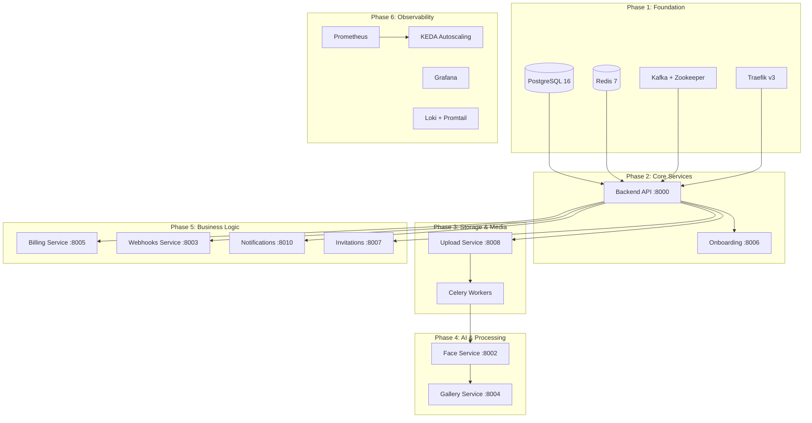
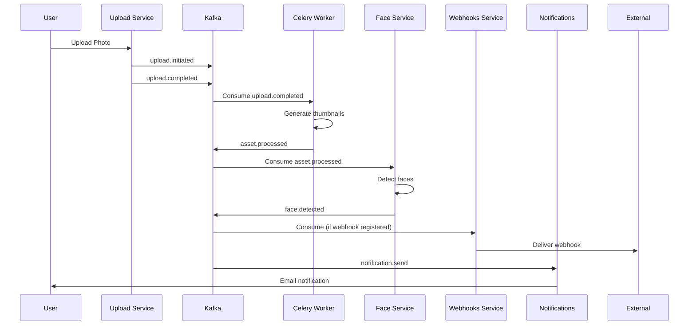

# vDrive Step-by-Step Development Plan

This document outlines the development order for the vDrive platform based on service dependencies, event-driven architecture patterns, and KEDA scaling configurations.

## Development Overview



---

## Phase 1: Infrastructure Foundation

> [!IMPORTANT]
> All services depend on this layer. Deploy first with health checks verified.

### Component Order

| Order | Component | Port | Dependencies | Health Check |
|-------|-----------|------|--------------|--------------|
| 1.1 | PostgreSQL 16 | 5432 | None | `pg_isready` |
| 1.2 | Redis 7 | 6379 | None | `redis-cli ping` |
| 1.3 | Zookeeper | 2181 | None | `ruok` command |
| 1.4 | Kafka | 9092 | Zookeeper | `kafka-topics --list` |
| 1.5 | Kafka Topic Init | - | Kafka | Topics created |
| 1.6 | Traefik v3 | 80, 443, 8080 | Redis | `/ping` endpoint |
| 1.7 | Kafka UI | 8081 | Kafka | `/actuator/health` |

### Kafka Topics to Create

```bash
# Upload events
upload.initiated        (6 partitions, 7d retention)
upload.completed        (6 partitions, 7d retention)

# Asset processing
asset.processing        (12 partitions, 3d retention)
asset.processed         (12 partitions, 7d retention)

# Face detection
face.detected           (6 partitions, 7d retention)

# Webhooks
webhook.pending         (6 partitions, 3d retention)
webhook.dlq             (3 partitions, 30d retention)

# Notifications
notification.send       (6 partitions, 3d retention)

# Gallery events
gallery.created         (6 partitions, 7d retention)
gallery.published       (6 partitions, 7d retention)

# User events
user.registered         (3 partitions, 7d retention)
user.subscription.changed (3 partitions, 7d retention)

# AI/Search events (Phase 4.3)
asset.embedding.generated (6 partitions, 7d retention)
search.query.logged       (3 partitions, 30d retention)
```

### Topic Partition Strategy

| Partitions | Use Case | Rationale |
|------------|----------|-----------|
| 3 | Low-volume events (user.registered) | Max 3 consumers needed |
| 6 | Standard events | Balance parallelism vs overhead |
| 12 | High-throughput (asset.processing) | Matches max Celery workers |

### Kafka Consumer Groups

| Service | Consumer Group |
|---------|----------------|
| Celery Workers | `vdrive-celery` |
| Upload Service | `vdrive-upload-processor` |
| Face Service | `vdrive-face-detector` |
| Webhooks Service | `vdrive-webhooks-processor` |
| Notifications | `vdrive-notifications` |

### 1.8 Health Check Configuration

| Service | Check | Interval | Timeout | Retries |
|---------|-------|----------|---------|---------|
| PostgreSQL | `pg_isready` | 10s | 5s | 5 |
| Redis | `redis-cli ping` | 10s | 5s | 5 |
| Zookeeper | `echo ruok \| nc localhost 2181` | 10s | 5s | 5 |
| Kafka | `kafka-topics --list` | 15s | 10s | 5 |
| Traefik | `GET /ping` | 10s | 5s | 3 |

### 1.9 Redis Configuration

| Setting | Dev | Prod | Purpose |
|---------|-----|------|---------|
| Memory Limit | 256MB | 512MB | Max memory allocation |
| Eviction Policy | allkeys-lru | allkeys-lru | Remove least recently used keys |
| DB 0 | Cache | Cache | Application cache |
| DB 1 | Celery Broker | Celery Broker | Task queue messages |
| DB 2 | Celery Results | Celery Results | Task results storage |

### 1.10 Resource Limits

| Service | Memory | CPU | Storage |
|---------|--------|-----|---------|
| PostgreSQL | 2GB | 2 cores | 50GB |
| Redis | 512MB | 0.5 cores | - |
| Kafka | 1GB | 1 core | 20GB |
| Zookeeper | 512MB | 0.5 cores | 1GB |
| Traefik | 256MB | 0.25 cores | - |

### 1.11 Persistent Volumes

| Volume | Service | Purpose |
|--------|---------|---------|
| `vdrive-postgres-data` | PostgreSQL | Database files |
| `vdrive-redis-data` | Redis | RDB/AOF persistence |
| `vdrive-kafka-data` | Kafka | Message log segments |
| `vdrive-zookeeper-data` | Zookeeper | Coordination data |
| `vdrive-traefik-certs` | Traefik | Let's Encrypt certificates |

### 1.12 Database Strategy & Setup

**Schema Management:**
- **Tool**: Alembic (for Python-based services).
- **Migrations**: 12 numbered migrations (001-012) covering all domain models.
- **Core Models**:
  - Auth: `users`, `refresh_tokens`, `sessions`, `oauth_accounts`
  - Multi-tenancy: `workspaces`, `workspace_members`, `workspace_invites`
  - Content: `galleries`, `assets`, `asset_versions`, `magic_links`
  - AI/ML: `people`, `face_detections`, `face_embeddings`, `photo_embeddings`
  - Business: `clients`, `bookings`, `subscription_plans`, `subscriptions`, `invoices`
  - Comms: `notification_preferences`, `notification_logs`, `webhook_subscriptions`
  - Products: `albums`, `album_spreads`, `invitations`, `invitation_guests`
  - Audit: `audit_logs`
- **Initialization**:
    - `infrastructure/scripts/init-db.sql` creates initial databases, roles, and extensions.
    - Required extensions: `uuid-ossp`, `pgcrypto`, `pg_trgm`, `vector` (pgvector).
    - Application startup runs `alembic upgrade head` automatically.

**Extension Verification:**
```sql
-- Run after init to verify extensions
SELECT extname FROM pg_extension
WHERE extname IN ('uuid-ossp', 'pgcrypto', 'pg_trgm', 'vector');
```

**Migration Workflow:**
1.  Dev changes SQLModel definitions.
2.  `alembic revision --autogenerate -m "description"` creates migration script.
3.  `alembic upgrade head` applies changes.
4.  For production: Use `CONCURRENTLY` for large index creation.

---

## Phase 2: Core Backend Services

### 2.1 Backend API

| Attribute | Value |
|-----------|-------|
| **Port** | 8000 |
| **Dependencies** | PostgreSQL, Redis, Kafka |
| **KEDA Scaler** | Prometheus (HTTP RPS + P95 Latency) |
| **Min/Max Replicas** | 2 / 100 |

**Responsibilities:**
- Core multi-tenant logic, RBAC
- JWT authentication/authorization
- Database migrations (12 numbered migrations)
- Personal Profiles, Workspace Settings
- CRUD operations for all entities

**Events Produced:**
- `user.registered`
- `user.subscription.changed`
- `gallery.created`, `gallery.published`

### 2.2 Onboarding Service

| Attribute | Value |
|-----------|-------|
| **Port** | 8006 |
| **Dependencies** | Backend API, PostgreSQL, Redis |
| **KEDA Scaler** | Prometheus (HTTP RPS) |
| **Min/Max Replicas** | 2 / 20 |

**Responsibilities:**
- User registration
- Email verification
- Workspace initialization

### 2.3 Public Website

| Attribute | Value |
|-----------|-------|
| **Stack** | Astro (Static Site Generation + Islands) |
| **Location** | `services/website` |
| **Port** | 3000 |
| **Dependencies** | Backend API (for auth/checkout) |

**Core Pages:**
- **Landing**: `index.astro` (Marketing & Value Prop)
- **Features**: `features.astro` (Product Tour)
- **Pricing**: `pricing.astro` (Plans & Stripe Integration)
- **Resources**: `blog/`, `docs/`

### 2.4 Authentication & Signin Flow

**Architecture:**
- **Standard**: OAuth2 Password Grant / JWT.
- **Tokens**: 
    - `access_token` (Short-lived, JSON response, for API calls).
    - `refresh_token` (Long-lived, HttpOnly Cookie, for session renewal).

**Signin Process:**
1.  User visits `/signin` (Frontend Route).
2.  Submits credentials to `POST /api/v1/auth/login` (Backend).
3.  On success:
    - Backend sets `refresh_token` cookie.
    - Returns `access_token` and user profile.
    - Frontend redirects to `/dashboard` (or intended target).

---

## Phase 3: Storage & Media Processing

### 3.1 Upload Service

| Attribute | Value |
|-----------|-------|
| **Port** | 8008 |
| **Dependencies** | Backend API, Kafka, R2 Storage |
| **KEDA Scaler** | Kafka (upload.completed lag) + Prometheus |
| **Min/Max Replicas** | 2 / 50 |

**Responsibilities:**
- TUS protocol resumable uploads
- Chunked file handling
- AES-256 encryption
- Publish to Kafka

**Events Produced:**
- `upload.initiated`
- `upload.completed`

**Events Consumed:**
- None (producer only)

### 3.2 Celery Workers

| Attribute | Value |
|-----------|-------|
| **Deployment** | celery-worker, celery-worker-ai, celery-beat |
| **Dependencies** | Redis (broker), PostgreSQL, R2 |
| **KEDA Scaler** | Redis queue length |
| **Min/Max Replicas** | 2 / 20 |

**Task Types:**

| Worker | Tasks |
|--------|-------|
| General | Thumbnails, Email delivery, Notifications |
| AI | Face detection, Smart curate, Quality scoring |
| Beat | Cleanup jobs, Scheduled tasks, Retention |

**Events Consumed:**
- `upload.completed` → Generate thumbnails
- `asset.processing` → AI analysis

**Events Produced:**
- `asset.processed`

---

## Phase 4: AI & Gallery Services

### 4.1 Face Service

| Attribute | Value |
|-----------|-------|
| **Port** | 8002 |
| **Dependencies** | Backend API, Celery Workers, Kafka |
| **KEDA Scaler** | Kafka (face.detected lag) + Prometheus |
| **Min/Max Replicas** | 2 / 50 |
| **Cooldown** | 120s (AI workloads) |

**Responsibilities:**
- Google Cloud Vision face detection
- ArcFace 512-dimension embeddings
- "Find Me" feature
- People group management
- **Future Integration during development**: Google ADK (A2A Protocol) for agentic collaboration with Gallery/AI services.

**Events Consumed:**
- `asset.processed`

**Events Produced:**
- `face.detected`

### 4.3 AI & Search Service (GEO)

| Attribute | Value |
|-----------|-------|
| **Port** | 8009 |
| **Dependencies** | Backend API, Milvus/pgvector, Google Gemini |
| **KEDA Scaler** | Prometheus (HTTP RPS) |
| **Min/Max Replicas** | 2 / 20 |

**Responsibilities:**
- Semantic Search (Text-to-Image) via Milvus/pgvector.
- RAG (Retrieval-Augmented Generation) for "Ask my photos".
- Smart Curation & Caption Generation using LLMs.
- Generative Engine Optimization (GEO).
- **Core Framework**: Google ADK (Agent Development Kit) supporting A2A Protocol for multi-agent coordination.

**Integration Points:**
- Consumes `asset.processed` for embedding generation.
- exposes Search API for Frontend.

### 4.2 Gallery Service

| Attribute | Value |
|-----------|-------|
| **Port** | 8004 |
| **Dependencies** | Backend API, Face Service |
| **KEDA Scaler** | Prometheus (HTTP RPS + WebSocket connections) |
| **Min/Max Replicas** | 5 / 50 |

**Responsibilities:**
- High-traffic public gallery viewing
- Magic Links
- Client Preview
- WebSocket real-time updates
- Batch operations
- LQIP placeholders, Signed URLs

**Events Consumed:**
- `gallery.published`
- `face.detected`

---

## Phase 5: Business Logic Services

### 5.1 Billing Service

| Attribute | Value |
|-----------|-------|
| **Port** | 8005 |
| **Dependencies** | Backend API, Stripe, Razorpay |
| **KEDA Scaler** | Prometheus (HTTP RPS) |
| **Min/Max Replicas** | 2 / 20 |

**Responsibilities:**
- Stripe/Razorpay payment integration
- Subscription management
- Invoice generation
- Quota enforcement

**Traefik Priority:**
- `/webhooks/stripe` → Priority 150 (no rate limit)
- `/api/v1/subscription` → Priority 145

### 5.2 Webhooks Service

| Attribute | Value |
|-----------|-------|
| **Port** | 8003 |
| **Dependencies** | Backend API, Kafka |
| **KEDA Scaler** | Kafka (webhook.pending lag) |
| **Min/Max Replicas** | 2 / 20 |

**Responsibilities:**
- HMAC-signed webhook delivery (Stripe-compatible signatures).
- Retry logic with exponential backoff (up to 72 hours).
- Circuit breaker pattern.
- Dead Letter Queue (DLQ).

**Target Integrations:**
- **Stripe**: `user.subscription.changed` → Sync subscription status.
- **SendGrid/Twilio**: Delivery status updates.
- **Client Webhooks**: Notify external user URLs of events (e.g. `gallery.published`).

**Events Consumed:**
- `webhook.pending`

**Events Produced:**
- `webhook.dlq` (failed deliveries)

### 5.3 Notifications Service

| Attribute | Value |
|-----------|-------|
| **Port** | 8010 |
| **Dependencies** | Backend API, SendGrid, Kafka |
| **KEDA Scaler** | Kafka (notification.send lag) |
| **Min/Max Replicas** | 2 / 10 |

**Responsibilities:**
- Multi-channel communications (Email, Push)
- SendGrid integration
- Template management
- **Future Integration during development**: Use A2A Protocol for intelligent notification routing and user preference negotiation.

**Events Consumed:**
- `notification.send`

### 5.4 Invitations Service

| Attribute | Value |
|-----------|-------|
| **Port** | 8007 |
| **Dependencies** | Backend API, Notifications Service |
| **KEDA Scaler** | Prometheus (HTTP RPS) |
| **Min/Max Replicas** | 2 (fixed, low traffic) |

**Responsibilities:**
- Wedding/Event digital invitations
- RSVP management
- Guest list tracking
- Bulk email campaigns

- Bulk email campaigns

---

## Phase 6: Mobile & Client Experience

### 6.1 Mobile Companion App

**Tech Stack:** React Native (Shared logic with Web).
**Target Users:** Photographers (Admin logic), Clients (Gallery viewing).
**Features:**
- Offline support (WatermelonDB).
- Biometric Auth.
- Push Notifications (via Notifications Service).
- Mobile Upload (BTS contents).

### 6.2 Client Portal Enhancements

- **Self-Service**: Print ordering, download management.
- **CRM Integration**: Visitor tracking, engagement metrics.

---

## Phase 7: Observability & Autoscaling

### 6.1 Monitoring Stack

| Order | Component | Port | Purpose |
|-------|-----------|------|---------|
| 6.1.1 | Prometheus | 9090 | Metrics collection |
| 6.1.2 | Alertmanager | 9094 | Alert routing |
| 6.1.3 | Loki | 3100 | Log aggregation |
| 6.1.4 | Promtail | - | Log shipping |
| 6.1.5 | Grafana | 3001 | Dashboards |

### 6.2 Exporters

| Component | Port | Target |
|-----------|------|--------|
| Redis Exporter | 9121 | Redis metrics |
| Postgres Exporter | 9187 | PostgreSQL metrics |
| Kafka Exporter | 9308 | Kafka metrics |
| Flower | 5555 | Celery monitoring |

### 6.3 KEDA Autoscaling Setup

Install KEDA:
```bash
kubectl apply -f https://github.com/kedacore/keda/releases/download/v2.12.0/keda-2.12.0.yaml
kubectl get pods -n keda
```

Apply ScaledObjects:
```bash
kubectl apply -f infrastructure/kubernetes/base/keda/scaledobjects.yaml
```

---

## Event-Driven Architecture Patterns

### Event Flow Diagram



### Pattern Implementations

| Pattern | Where Used | Implementation |
|---------|------------|----------------|
| **Saga** | User Registration | Onboarding → Backend → Notifications |
| **CQRS** | Gallery Reads | Separate read models for public views |
| **Event Sourcing** | Audit Logs | All mutations logged to Kafka |
| **Circuit Breaker** | Webhooks | Fail-fast on repeated failures |
| **Dead Letter Queue** | Webhooks | `webhook.dlq` for failed deliveries |
| **Outbox Pattern** | All Services | Transactional outbox → Kafka publish |

---

## KEDA Scaling Configurations

### Trigger Types Summary

| Trigger Type | Services | Metric |
|--------------|----------|--------|
| **Prometheus** | Backend, Gallery, Billing, Onboarding | HTTP RPS, P95 Latency |
| **Kafka** | Upload, Face, Webhooks, Notifications | Consumer lag |
| **Redis** | Celery Workers | Queue length |

### Scaling Thresholds

| Service | Trigger | Threshold | Min | Max |
|---------|---------|-----------|-----|-----|
| Backend | HTTP RPS | 100 req/replica | 2 | 100 |
| Backend | P95 Latency | > 500ms | 2 | 100 |
| Gallery | HTTP RPS | 100 req/replica | 5 | 50 |
| Gallery | WebSocket | 500 connections | 5 | 50 |
| Upload | Kafka Lag | 100 messages | 2 | 50 |
| Face | Kafka Lag | 50 messages | 2 | 50 |
| Webhooks | Kafka Lag | 50 messages | 2 | 20 |
| Notifications | Kafka Lag | 100 messages | 2 | 10 |
| Celery | Redis Queue | 100 tasks | 2 | 20 |

### Cooldown Periods

| Service Type | Cooldown | Reason |
|--------------|----------|--------|
| Standard | 60s | Normal workloads |
| AI (Face) | 120s | Prevent thrashing on ML tasks |
| Bursty | 30s | Quick scale-down for spikes |

---

## Service Dependency Matrix

```
                    ┌─────┬─────┬─────┬─────┬─────┬─────┬─────┬─────┬─────┐
                    │ PG  │Redis│Kafka│Back │Gall │Upld │Face │Bill │Notif│
┌───────────────────┼─────┼─────┼─────┼─────┼─────┼─────┼─────┼─────┼─────┤
│ Backend           │  ●  │  ●  │  ●  │  -  │  -  │  -  │  -  │  -  │  -  │
│ Gallery Service   │  ●  │  ●  │  ●  │  ●  │  -  │  -  │  -  │  -  │  -  │
│ Upload Service    │  ●  │  ●  │  ●  │  ●  │  -  │  -  │  -  │  -  │  -  │
│ Face Service      │  ●  │  ●  │  ●  │  ●  │  -  │  -  │  -  │  -  │  -  │
│ Billing Service   │  ●  │  ●  │  ○  │  ●  │  -  │  -  │  -  │  -  │  -  │
│ Webhooks Service  │  ●  │  ●  │  ●  │  ●  │  -  │  -  │  -  │  -  │  -  │
│ Notifications     │  ●  │  ●  │  ●  │  ●  │  -  │  -  │  -  │  -  │  -  │
│ Onboarding        │  ●  │  ●  │  ○  │  ●  │  -  │  -  │  -  │  -  │  -  │
│ Invitations       │  ●  │  ●  │  ○  │  ●  │  -  │  -  │  -  │  -  │  ●  │
│ Celery Workers    │  ●  │  ●  │  ●  │  ○  │  -  │  -  │  -  │  -  │  -  │
└───────────────────┴─────┴─────┴─────┴─────┴─────┴─────┴─────┴─────┴─────┘

● = Required dependency
○ = Optional/async dependency
- = No dependency
```

---

## Development Phases Summary

| Phase | Services | Duration Est. | Key Milestone |
|-------|----------|---------------|---------------|
| **1** | PostgreSQL, Redis, Kafka, Traefik | 1 week | Infrastructure ready |
| **2** | Backend API, Onboarding | 2 weeks | User auth working |
| **3** | Upload Service, Celery | 2 weeks | Photo upload pipeline |
| **4** | Face Service, Gallery | 3 weeks | AI + public galleries |
| **5** | Billing, Webhooks, Notifications, Invitations | 2 weeks | Business logic complete |
| **6** | Mobile App, Client Portal Enhancements | 3 weeks | Mobile ecosystem ready |
| **7** | Prometheus, Grafana, Loki, KEDA | 1 week | Full observability |
| **8** | Production Readiness (Security/Load Testing) | 1 week | Go-live ready |

**Total Estimated Timeline: ~15 weeks**

---

## Production Readiness Checklist

Before "Go-Live", ensure the following are completed (ref: `docs/project/07-PROD_CHECKLIST.md`):

1.  **Security Audit**:
    - [ ] JWT/OAuth flows verified.
    - [ ] RBAC enforcement tests passing (Backend middleware).
    - [ ] Rate limiting active (Traefik + Redis).
    - [ ] Secrets rotation tested.

2.  **Performance & Load**:
    - [ ] KEDA scaling triggers verified (load test 1k RPS).
    - [ ] Database indexing optimized (pg_stat_statements).
    - [ ] CDN caching rules active (Cloudflare).

3.  **Disaster Recovery**:
    - [ ] Database Point-in-Time Recovery (PITR) tested.
    - [ ] R2 Bucket replication/backup verified.

---

## Verification Plan

### Deployment Verification

1. **Phase 1 Verification**
   ```bash
   # Verify PostgreSQL
   docker compose exec postgres pg_isready -U vdrive

   # Verify Redis
   docker compose exec redis redis-cli ping

   # Verify Kafka topics (should show 14 topics)
   docker compose exec kafka kafka-topics --bootstrap-server localhost:9092 --list

   # Verify PostgreSQL extensions
   docker compose exec postgres psql -U vdrive -c "SELECT extname FROM pg_extension;"

   # Verify Kafka UI is accessible
   curl -s http://localhost:8081/actuator/health | grep UP

   # Verify metrics exporters
   curl -s http://localhost:9187/metrics | head -5  # Postgres exporter
   curl -s http://localhost:9121/metrics | head -5  # Redis exporter
   curl -s http://localhost:9308/metrics | head -5  # Kafka exporter
   ```

2. **Phase 2+ Service Health**
   ```bash
   # Check all service health endpoints
   curl http://localhost:8000/health  # Backend
   curl http://localhost:8004/health  # Gallery
   curl http://localhost:8005/health  # Billing
   # etc.
   ```

3. **KEDA Verification**
   ```bash
   kubectl get scaledobjects -n vdrive
   kubectl get hpa -n vdrive
   kubectl describe scaledobject backend-scaledobject -n vdrive
   ```

### Manual Testing

The user should verify:
1. User registration flow through Onboarding Service
2. Photo upload and thumbnail generation
3. Face detection on uploaded photos
4. Public gallery access via Magic Links
5. Webhook delivery to test endpoint
