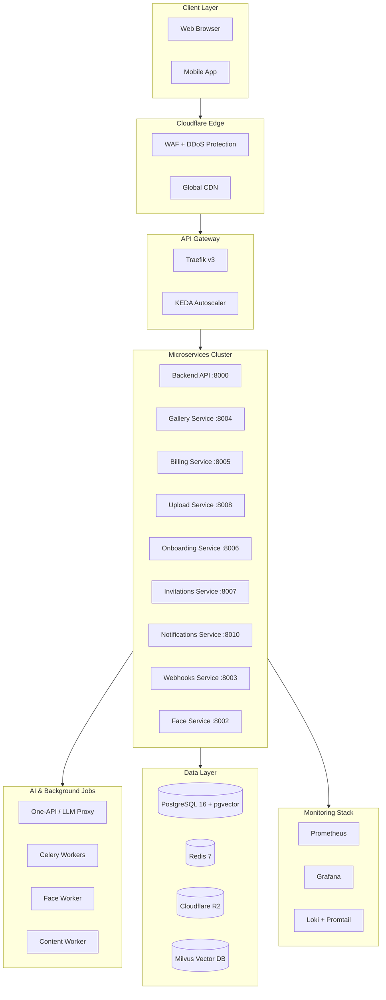

# RawDrive Architecture Guide

**Version:** 0.3.3 | **Last Updated:** January 2026

---

## System Overview

RawDrive is a multi-tenant SaaS platform built on a modern, scalable microservices architecture designed for 20,000+ photographers with high performance, reliability, and security.

---

## Architecture Diagram



---

## Architecture Layers

### 1. Client Layer
- Web browsers (React SPA)
- Mobile apps (future)
- HTTPS/TLS 1.3 encrypted connections

### 2. Cloudflare Edge Layer
| Component | Purpose |
|-----------|---------|
| WAF | Web Application Firewall - block malicious traffic |
| DDoS Protection | Automatic attack mitigation |
| CDN | Global content delivery |
| Rate Limiting | Per-IP and per-user limits |
| Bot Management | Challenge pages for suspicious traffic |
| Turnstile | Bot protection for high-risk endpoints |

### 3. Frontend Layer
- **Framework:** React 19 + TypeScript + Vite
- **Styling:** Tailwind CSS + Framer Motion
- **Shared Packages:** pnpm workspaces (`@RawDrive/shared-*`)
- **PWA:** Service Worker with Workbox caching
- **Caching Strategies:**
  - `RawDrive-thumbnails`: CacheFirst (500 entries, 7-day expiry)
  - `RawDrive-gallery-api`: StaleWhileRevalidate (100 entries, 5-min)
  - `RawDrive-auth`: NetworkFirst (20 entries, 10-min)

### 4. API Gateway (Traefik v3)
| Feature | Description |
|---------|-------------|
| Routing | Priority-based IngressRoute CRDs |
| TLS | Automatic Let's Encrypt certificates |
| Rate Limiting | Per-endpoint middleware |
| Autoscaling | KEDA with Traefik metrics |
| Health Checks | `/health`, `/ready`, `/metrics` endpoints |

**Routing Priority Table:**
| Priority | Route | Service |
|----------|-------|---------|
| 150 | `/webhooks/stripe` | billing-service |
| 148 | `/webhooks/razorpay` | billing-service |
| 145 | `/api/v1/subscription/*` | billing-service |
| 142 | `/api/v1/webhooks/*` | webhooks-service |
| 140 | `/api/v1/galleries/*` | gallery-service |
| 135 | `/api/v1/uploads/*` | upload-service |
| 100 | `/api/*` | backend (fallback) |

### 5. Backend Services

All services are independently scalable and KEDA-enabled:

| Service | Port | Purpose | Scaling |
|---------|------|---------|---------|
| **Backend API** | 8000 | Core multi-tenant logic, RBAC | 2-100 replicas |
| **Gallery Service** | 8004 | Public viewing, Magic Links, WebSocket | 5-20 replicas |
| **Billing Service** | 8005 | Stripe/Razorpay, subscriptions | 2-20 replicas |
| **Upload Service** | 8008 | TUS resumable uploads, chunking | 2-50 replicas |
| **Onboarding Service** | 8006 | Registration, workspace setup | 2-20 replicas |
| **Invitations Service** | 8007 | Digital invitations, RSVP | Standard |
| **Notifications Service** | 8010 | Multi-channel notifications | 2-10 replicas |
| **Webhooks Service** | 8003 | Event-driven webhook delivery | 2-20 replicas |
| **Face Service** | 8002 | Face detection, recognition | 2-50 replicas |

### 6. Data Layer

#### PostgreSQL 16 Database
| Extension | Purpose |
|-----------|---------|
| `pgvector` | Vector similarity search (HNSW, IVFFlat) |
| `pgvectorscale` | Enhanced indexing (StreamingDiskANN for >10M vectors) |
| `uuid-ossp` | UUID generation |
| `pg_trgm` | Fuzzy text search |

**Docker Image:** `timescale/timescaledb-ha:pg16`

#### Redis 7 Cache
- Sessions and authentication tokens
- API response caching
- Pub/sub messaging
- Celery task broker
- Rate limiting counters

#### Cloudflare R2 Storage
- S3-compatible object storage
- No egress fees
- Global CDN delivery
- BYOS backup options

#### Milvus Vector DB
- Face embedding storage
- Semantic search vectors
- High-performance similarity search

### 7. Background Jobs

| Queue | Technology | Tasks |
|-------|------------|-------|
| **Python Jobs** | Celery + Redis | Photo processing, AI analysis, email delivery |
| **Node Jobs** | BullMQ | Frontend workers, webhooks |

**Task Types:**
- Photo processing (thumbnails, LQIP, derivatives)
- AI analysis (quality scoring, face detection, tagging)
- Email delivery (transactional, newsletters)
- Webhook delivery (with retries and circuit breaker)
- Scheduled tasks (cleanup, reports, workspace deletion)
- Type generation (TS → Python sync)

### 8. Observability Stack

| Component | Port | Purpose |
|-----------|------|---------|
| Prometheus | 9090 | Metrics collection |
| Grafana | 3001 | Dashboards |
| Loki | 3100 | Log aggregation |
| Promtail | - | Log collection |
| Alertmanager | 9093 | Alert routing |
| Tempo | 3200 | Distributed tracing |

---

## Key Architectural Principles

### Multi-Tenancy
```python
# EVERY query MUST include workspace_id
result = await db.execute(
    select(Asset).where(Asset.workspace_id == workspace_id)
)
# NEVER trust client-provided workspace_id - extract from JWT
```

### Security
- **Defense in Depth:** Multiple layers of protection
- **Encryption:** TLS 1.3 in transit, AES-256 at rest
- **Authentication:** JWT (15-min) + Refresh tokens (7-day)
- **Authorization:** RBAC with workspace scoping

### Performance Targets

| Metric | Target |
|--------|--------|
| Page Load (P95) | <300ms |
| API Response (P95) | <300ms |
| Database Query | <100ms |
| Image Delivery (4G) | <2s |
| Uptime | 99.9% |
| Error Rate | <1% |

### Gallery Performance (v0.3.2)

| Metric | Before | After | Method |
|--------|--------|-------|--------|
| First Contentful Paint | 2-3s | <1s | LQIP placeholders |
| Thumbnail Load (cached) | 200-500ms | <100ms | Service Worker + immutable cache |
| Gallery Scroll | 150-300ms | <50ms | Prefetching at 75% scroll |
| Cache Hit Rate | ~30% | >80% | Extended URL TTL (4hr) |

### Scalability (KEDA-First)

| Scaler | Threshold | Action |
|--------|-----------|--------|
| HTTP RPS | >100 req/s | Scale up |
| P95 Latency | >500ms | Scale up |
| Queue Depth | >500 jobs | Scale up workers |
| CPU Usage | >70% | Scale up |

---

## Deployment Architecture

### Development
### Development
```bash
# Start standard development stack (Postgres, Redis, Kafka, Traefik)
docker compose -f infrastructure/docker/docker-compose.dev.yml up -d

# Run Frontend
cd frontend && pnpm dev
```

### Staging
- Kubernetes namespace
- Separate staging database
- Cloudflare R2 staging bucket
- Full observability stack

### Production
- Hostinger VPS + Kubernetes (kubeadm)
- PostgreSQL with replication
- Cloudflare R2 production bucket
- Full monitoring with alerting

---

## Storage Key Format

```
workspaces/{workspace_id}/assets/{asset_id}/original/{filename}
workspaces/{workspace_id}/assets/{asset_id}/thumbnails/{size}/{filename}
workspaces/{workspace_id}/assets/{asset_id}/lqip/{filename}
```

---

## External Integrations

### AI Providers
- **Primary:** Google Gemini (text + vision)
- **Fallback:** OpenAI, Anthropic
- **Enterprise:** Azure OpenAI
- **Self-Hosted:** Ollama, LM Studio

### Payment Gateways
- **Primary:** Razorpay (India-first, UPI support)
- **Alternative:** Stripe

### Email Service
- **Provider:** SendGrid
- **Features:** Transactional templates, webhooks

### Authentication
- **OAuth:** Google, GitHub
- **Enterprise:** SAML/OIDC (Azure AD)

### Storage (BYOS)
- Google Drive (OAuth)
- Dropbox (OAuth)
- AWS S3 (IAM)
- Azure Blob (Connection string)

---

## Related Documentation

- **Detailed Tech Stack:** [02-TECH-STACK.md](02-TECH-STACK.md)
- **Security Requirements:** [09-SECURITY-GUIDELINES.md](09-SECURITY-GUIDELINES.md)
- **Microservices Guide:** [10-MICROSERVICES-GUIDE.md](10-MICROSERVICES-GUIDE.md)
- **Infrastructure:** `infrastructure/` directory
