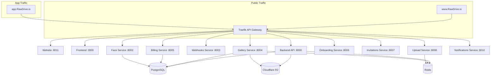

# RawDrive Microservices Guide

**Version:** 0.4.0 | **Last Updated:** January 2026

---

## Microservices Overview

RawDrive uses a microservices architecture with 11+ independently deployable services, including separate frontends for public website and authenticated app:



---

## Domain Architecture

| Domain | Service | Purpose |
|--------|---------|---------|
| `www.RawDrive.io` | Website Service | Public marketing, blog, docs |
| `app.RawDrive.io` | Frontend (React) | Authenticated application |
| `app.RawDrive.io/api/*` | Backend + Services | API endpoints |

---

## Service Catalog

| Service | Port | Purpose | Scaling |
|---------|------|---------|---------|
| **Website** | 8011 | Public site (Astro) - marketing, blog, docs | 2-10 replicas |
| **Frontend** | 3000 | App frontend (React) - authenticated app | 2-20 replicas |
| **Backend API** | 8000 | Core API, RBAC, Workspaces | 2-100 replicas |
| **Face Service** | 8002 | Face detection, recognition, FaceIDs | 2-50 replicas |
| **Webhooks Service** | 8003 | Event-driven webhook delivery | 2-20 replicas |
| **Gallery Service** | 8004 | Public galleries, Magic Links, WebSocket | 5-20 replicas |
| **Billing Service** | 8005 | Subscriptions, Stripe/Razorpay | 2-20 replicas |
| **Onboarding Service** | 8006 | Registration, workspace setup | 2-20 replicas |
| **Invitations Service** | 8007 | Digital invitations, RSVP | Standard |
| **Upload Service** | 8008 | TUS resumable uploads | 2-50 replicas |
| **Notifications Service** | 8010 | Multi-channel notifications | 2-10 replicas |

---

## Service Communication

### Shared Resources

| Resource | Purpose |
|----------|---------|
| PostgreSQL | Shared database (workspace isolation) |
| Redis | Caching, sessions, message broker |
| JWT Secret | Shared authentication secret |
| Cloudflare R2 | Object storage |

### API Gateway (Traefik v3)

**Routing Priority (Host-Based + Path-Based):**

| Priority | Rule | Service |
|----------|------|---------|
| 250 | `Host(app.RawDrive.io) && PathPrefix(/api)` | backend |
| 200 | `Host(www.RawDrive.io) \|\| Host(RawDrive.io)` | website-service |
| 200 | `Host(app.RawDrive.io)` | frontend-service |
| 150 | `/webhooks/stripe` | billing-service |
| 148 | `/webhooks/razorpay` | billing-service |
| 145 | `/api/v1/subscription/*` | billing-service |
| 142 | `/api/v1/webhooks/*` | webhooks-service |
| 140 | `/api/v1/galleries/*` | gallery-service |
| 135 | `/api/v1/uploads/*` | upload-service |
| 130 | `/api/v1/face/*` | face-service |
| 100 | `/api/*` | backend (fallback) |

---

## Service Directory Structure

Each microservice follows this standard structure:

```
services/{service-name}/
├── src/
│   ├── api/v1/              # API endpoints
│   │   ├── __init__.py
│   │   └── routes.py
│   ├── services/            # Business logic
│   │   └── {name}_service.py
│   ├── repositories/        # Database access (if needed)
│   │   └── {name}_repository.py
│   ├── schemas/             # Pydantic schemas
│   │   └── {name}_schemas.py
│   ├── middleware/          # Service middleware
│   │   └── auth.py
│   ├── cache/               # Redis client
│   │   └── redis_client.py
│   ├── observability/       # Metrics, health checks
│   │   ├── health.py
│   │   └── metrics.py
│   ├── config.py            # Service configuration
│   └── main.py              # FastAPI application
├── tests/
│   ├── unit/
│   ├── integration/
│   └── load/
├── Dockerfile
├── requirements.txt
└── README.md
```

---

## Backend API (Port 8000)

**Purpose:** Core multi-tenant logic, RBAC, user management, workspace settings.

**Key Endpoints:**
```
/api/v1/auth/*           # Authentication
/api/v1/users/*          # User management
/api/v1/workspaces/*     # Workspace management
/api/v1/personal-profile/* # Personal profiles
/api/v1/settings/*       # Workspace settings
```

**Location:** `backend/src/app/`

---

## Face Service (Port 8002)

**Purpose:** Face detection, recognition, embedding generation, "Find Me" search.

**Key Features:**
- Google Cloud Vision for face detection
- ArcFace ONNX model for 512-d embeddings
- Milvus vector database for similarity search
- People management with auto-grouping

**Key Endpoints:**
```
POST /api/v1/face/detect           # Detect faces in image
POST /api/v1/face/search           # Find similar faces
GET  /api/v1/face/people           # List people
POST /api/v1/face/people/merge     # Merge face groups
```

**Location:** `services/face-service/`

---

## Webhooks Service (Port 8003)

**Purpose:** Event-driven webhook delivery with reliability guarantees.

**Key Features:**
- HMAC-SHA256 signature verification
- Exponential backoff retry (0-10 retries)
- Circuit breaker per endpoint
- Secret rotation with 24h grace period
- Dead letter queue

**Key Endpoints:**
```
GET  /api/v1/webhooks              # List subscriptions
POST /api/v1/webhooks              # Create subscription
POST /api/v1/webhooks/{id}/rotate  # Rotate secret
GET  /api/v1/webhooks/{id}/deliveries # View deliveries
```

**Event Catalog:**
- `gallery.created`, `gallery.updated`, `gallery.deleted`
- `asset.uploaded`, `asset.processed`
- `user.created`, `user.updated`
- `workspace.created`, `workspace.updated`

**Location:** `services/webhooks-service/`

---

## Gallery Service (Port 8004)

**Purpose:** High-performance public gallery viewing, Magic Links, WebSocket proofing.

**Key Features:**
- 50K concurrent users support
- Real-time selection sync (WebSocket)
- Magic Link generation
- Client Preview mode
- Batch operations

**Key Endpoints:**
```
GET  /api/v1/galleries/{id}         # Get gallery
GET  /api/v1/galleries/{id}/assets  # List assets
POST /api/v1/galleries/{id}/magic-link # Generate magic link
WS   /api/v1/galleries/{id}/ws      # WebSocket proofing
```

**Location:** `services/gallery-service/`

---

## Billing Service (Port 8005)

**Purpose:** Payment processing, subscription management.

**Key Features:**
- Razorpay integration (India)
- Stripe integration (Global)
- Subscription lifecycle management
- Usage metering
- GST-compliant invoicing

**Key Endpoints:**
```
POST /api/v1/subscription/create     # Create subscription
POST /api/v1/subscription/cancel     # Cancel subscription
GET  /api/v1/subscription/status     # Get status
POST /webhooks/stripe                # Stripe webhook
POST /webhooks/razorpay              # Razorpay webhook
```

**Location:** `services/billing-service/`

---

## Onboarding Service (Port 8006)

**Purpose:** User registration, email verification, workspace creation.

**Key Features:**
- Email verification flow
- Workspace initialization
- Trial period setup
- Stripe payment integration

**Key Endpoints:**
```
POST /api/v1/onboarding/register     # Register user
POST /api/v1/onboarding/verify-email # Verify email
POST /api/v1/onboarding/setup-workspace # Create workspace
```

**Location:** `services/onboarding-service/`

---

## Invitations Service (Port 8007)

**Purpose:** Digital wedding invitations, RSVP management.

**Key Features:**
- Invitation templates
- Multi-language support (13 Indian languages)
- RSVP collection
- Guest list management
- Export (CSV/PDF)

**Key Endpoints:**
```
GET  /api/v1/invitations             # List invitations
POST /api/v1/invitations             # Create invitation
POST /api/v1/invitations/{id}/rsvp   # Submit RSVP
GET  /api/v1/invitations/{id}/guests # List guests
```

**Location:** `services/invitations-service/`

---

## Upload Service (Port 8008)

**Purpose:** TUS protocol resumable uploads with encryption.

**Key Features:**
- Resumable uploads (TUS protocol)
- Chunked uploads
- AES-256 encryption
- Kafka event emission
- Upload progress tracking

**Key Endpoints:**
```
POST /api/v1/uploads                 # Create upload
PATCH /api/v1/uploads/{id}           # Upload chunk
HEAD /api/v1/uploads/{id}            # Get upload status
```

**Location:** `services/upload-service/`

---

## Notifications Service (Port 8010)

**Purpose:** Multi-channel notification delivery.

**Key Features:**
- Email notifications (SendGrid)
- In-app notifications
- Preference management
- Template system

**Key Endpoints:**
```
POST /api/v1/notifications/send      # Send notification
GET  /api/v1/notifications           # List notifications
PATCH /api/v1/notifications/{id}/read # Mark as read
GET  /api/v1/notifications/preferences # Get preferences
```

**Location:** `services/notifications-service/`

---

## Creating a New Microservice

### 1. Create Directory Structure

```bash
mkdir -p services/{name}-service/src/{api/v1,services,schemas,middleware,cache,observability}
mkdir -p services/{name}-service/tests/{unit,integration,load}
```

### 2. Create Main Application

```python
# services/{name}-service/src/main.py
from fastapi import FastAPI
from src.api.v1 import routes
from src.observability.health import health_router
from src.middleware.auth import jwt_middleware

app = FastAPI(title="{Name} Service")

# Middleware
app.middleware("http")(jwt_middleware)

# Routes
app.include_router(health_router)
app.include_router(routes.router, prefix="/api/v1")

if __name__ == "__main__":
    import uvicorn
    uvicorn.run(app, host="0.0.0.0", port=800X)
```

### 3. Add Health Checks

```python
# src/observability/health.py
from fastapi import APIRouter

health_router = APIRouter(tags=["Health"])

@health_router.get("/health")
async def health_check():
    return {"status": "healthy"}

@health_router.get("/ready")
async def readiness_check():
    # Check dependencies
    return {"status": "ready"}
```

### 4. Add JWT Middleware

```python
# src/middleware/auth.py
import jwt
from fastapi import Request, HTTPException

async def jwt_middleware(request: Request, call_next):
    if request.url.path in ["/health", "/ready", "/metrics"]:
        return await call_next(request)

    auth = request.headers.get("Authorization")
    if not auth or not auth.startswith("Bearer "):
        raise HTTPException(401, "Missing token")

    token = auth.split(" ")[1]
    try:
        payload = jwt.decode(token, JWT_SECRET, algorithms=["HS256"])
        request.state.user = payload
    except jwt.InvalidTokenError:
        raise HTTPException(401, "Invalid token")

    return await call_next(request)
```

### 5. Add Prometheus Metrics

```python
# src/observability/metrics.py
from prometheus_client import Counter, Histogram

requests_total = Counter(
    "requests_total",
    "Total requests",
    ["method", "endpoint", "status"]
)

request_duration = Histogram(
    "request_duration_seconds",
    "Request duration",
    ["method", "endpoint"]
)
```

### 6. Create Dockerfile

```dockerfile
FROM python:3.11-slim

WORKDIR /app
COPY requirements.txt .
RUN pip install --no-cache-dir -r requirements.txt

COPY src/ ./src/
EXPOSE 800X

CMD ["uvicorn", "src.main:app", "--host", "0.0.0.0", "--port", "800X"]
```

### 7. Add to Docker Compose

```yaml
# infrastructure/docker/docker-compose.yml
{name}-service:
  build: ../../services/{name}-service
  ports:
    - "800X:800X"
  environment:
    - DATABASE_URL=${DATABASE_URL}
    - REDIS_URL=${REDIS_URL}
    - JWT_SECRET=${JWT_SECRET}
  depends_on:
    - postgres
    - redis
  restart: unless-stopped
```

### 8. Add Traefik Routing

```yaml
# infrastructure/docker/traefik/dynamic.yaml
http:
  routers:
    {name}-service:
      rule: "PathPrefix(`/api/v1/{name}`)"
      service: {name}-service
      priority: 130
      middlewares:
        - rate-limit

  services:
    {name}-service:
      loadBalancer:
        servers:
          - url: "http://{name}-service:800X"
```

---

## KEDA Autoscaling

### ScaledObject Example

```yaml
# infrastructure/kubernetes/base/keda/{name}-scaledobject.yaml
apiVersion: keda.sh/v1alpha1
kind: ScaledObject
metadata:
  name: {name}-service
spec:
  scaleTargetRef:
    name: {name}-service
  minReplicaCount: 2
  maxReplicaCount: 20
  triggers:
    - type: prometheus
      metadata:
        serverAddress: http://prometheus:9090
        metricName: http_requests_total
        threshold: "100"
        query: rate(traefik_service_requests_total{service="{name}-service"}[1m])
```

---

## Development Scripts

```bash
# Start service in dev mode
scripts/dev-{name}-service.sh

# Run tests
cd services/{name}-service && pytest

# Build Docker image
docker build -t RawDrive/{name}-service services/{name}-service
```

---

## Related Documentation

- **Architecture:** [01-ARCHITECTURE.md](01-ARCHITECTURE.md)
- **API Standards:** [07-API-STANDARDS.md](07-API-STANDARDS.md)
- **Infrastructure:** `infrastructure/` directory
