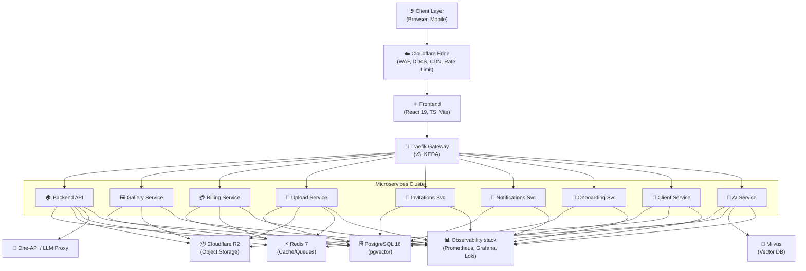

# RawDrive Technology Stack

## Overview

RawDrive is built on a modern, scalable technology stack designed to handle 20,000+ photographer customers with high performance, reliability, and security. This document outlines all technologies, frameworks, and services used in the platform.

## Architecture Overview

### ASCII Architecture Diagram

```
┌──────────────────────────────────────────────────────────────────────┐
│                          CLIENT LAYER                                 │
│         (Web Browser, Mobile Apps, Desktop Applications)              │
└────────────────────────────┬─────────────────────────────────────────┘
                             │ HTTPS/TLS 1.3
                             │
┌────────────────────────────▼─────────────────────────────────────────┐
│                      CLOUDFLARE EDGE                                  │
│              (WAF, DDoS Protection, CDN, Rate Limiting)               │
└────────────────────────────┬─────────────────────────────────────────┘
                             │
┌────────────────────────────▼─────────────────────────────────────────┐
│                    FRONTEND LAYER                                     │
│         (React 19, TypeScript, Vite, Tailwind CSS)                   │
│              Deployed on Hostinger VPS / Kubernetes                   │
└────────────────────────────┬─────────────────────────────────────────┘
                             │ REST API Calls
                             │
┌────────────────────────────▼─────────────────────────────────────────┐
│                   API GATEWAY & INGRESS                               │
│    (Traefik v3, KEDA Autoscaling, Rate Limiting, TLS)                 │
└────────────────────────────┬─────────────────────────────────────────┘
                             │
┌────────────────────────────▼─────────────────────────────────────────┐
│                    BACKEND LAYER                                      │
│         (Python 3.11+, FastAPI, asyncpg)                             │
│              Kubernetes Pods / Hostinger VPS                          │
│                                                                       │
│  ┌─────────────────────────────────────────────────────────────┐    │
│  │  Services: Auth, Gallery, Photo, Album, Client, Booking,   │    │
│  │  Payment, AI, Email, Background Jobs                        │    │
│  └─────────────────────────────────────────────────────────────┘    │
└────────────────────────────┬─────────────────────────────────────────┘
                             │
        ┌────────────────────┼────────────────────┐
        │                    │                    │
        │ SQL Queries        │ Cache Ops          │ File Operations
        │                    │                    │
┌───────▼──────┐    ┌────────▼────────┐   ┌──────▼──────────────┐
│  PostgreSQL  │    │  Redis Cache    │   │  Cloudflare R2      │
│  Database    │    │  (Sessions,     │   │  Object Storage     │
│  (ACID,      │    │   Cache Layer)  │   │  + CDN Delivery     │
│   pgvector)  │    │                 │   │                     │
└──────────────┘    └─────────────────┘   └─────────────────────┘
        │                    │                    │
        └────────────────────┼────────────────────┘
                             │
                             │ Metrics & Logs
                             │
┌────────────────────────────▼─────────────────────────────────────────┐
│              OBSERVABILITY & MONITORING LAYER                         │
│                                                                       │
│  Prometheus (Metrics) → Grafana (Dashboards)                         │
│  Loki (Logs) + Promtail (Log Collection)                             │
│  Tempo/Jaeger (Distributed Tracing)                                  │
│  Sentry/GlitchTip (Error Tracking)                                   │
│  Alertmanager (Alerting)                                             │
└───────────────────────────────────────────────────────────────────────┘

┌────────────────────────────────────────────────────────────────────────┐
│                    BACKGROUND JOBS LAYER                               │
│                                                                        │
│  BullMQ (Redis-based Job Queue)                                       │
│  - Photo Processing, AI Analysis, Email Delivery, Webhooks            │
│  - Scheduled Tasks, Retries, Dead Letter Queues                       │
└────────────────────────────────────────────────────────────────────────┘

┌────────────────────────────────────────────────────────────────────────┐
│                   EXTERNAL SERVICES & INTEGRATIONS                     │
│                                                                        │
│  AI: Google Gemini (via One-API), OpenAI, Anthropic, Azure OpenAI     │
│  Payments: Razorpay (India-first), Stripe                             │
│  Email: SendGrid                                                      │
│  Auth: Google OAuth, local MFA                                         │
│  Storage (BYOS): Google Drive, Dropbox, AWS S3                        │
└────────────────────────────────────────────────────────────────────────┘
```

Note: RawDrive’s default hosted stack uses **Cloudflare R2** for managed object storage and **Cloudflare CDN/WAF** at the edge.

### Mermaid Architecture Diagram



### Key Connections Explained

**Data Flow:**
- Clients connect via HTTPS through Cloudflare Edge (security & performance)
- Frontend makes REST API calls to specific Microservices through Traefik Gateway
- All services query PostgreSQL 16 (with pgvector for search) and Redis 7 (caching/queues)
- File operations (Upload/Serve) go through dedicated services to Cloudflare R2

**Processing Flow:**
- Upload Service handles resumable TUS uploads and triggers processing
- Local workers (face-worker, content-worker, quality-worker) process assets
- AI operations are proxied via One-API to Google Gemini or other providers

**Observability:**
- Full-stack monitoring via Prometheus (metrics), Loki (logs), and Grafana (dashboards)
- Automatic alerting via Alertmanager

**External Integrations:**
- AI operations use Google Gemini (with fallback providers)
- Payments processed through Razorpay (India-first) or Stripe
- Email delivery via SendGrid
- Authentication via OAuth providers
- BYOS storage synced with customer cloud providers

---

## Frontend Stack

### Core Framework

**React 18+**
- Modern UI library with hooks
- Component-based architecture
- Virtual DOM for performance
- Concurrent rendering

**TypeScript**
- Static type checking
- Better IDE support
- Improved code quality
- Reduced runtime errors

**Vite**
- Lightning-fast build tool
- Hot module replacement (HMR)
- Optimized production builds
- ES modules support

### UI and Styling

**Tailwind CSS**
- Utility-first CSS framework
- Responsive design system
- Dark mode support
- Custom theme configuration

**Lucide React**
- Icon library (1000+ icons)
- Consistent design
- Lightweight and performant
- SVG-based icons

**Framer Motion**
- Animation library
- Smooth transitions
- Gesture support
- Performance optimized

### State Management

**React Context API**
- Built-in state management
- No external dependencies
- Suitable for app-wide state
- Hooks-based API

**Custom Hooks**
- Reusable logic
- Encapsulation
- Composition patterns
- Type-safe

### Form Handling

**React Hook Form**
- Lightweight form library
- Minimal re-renders
- Built-in validation
- TypeScript support

**Zod**
- Schema validation
- Type inference
- Runtime validation
- Error messages

### HTTP Client

**Fetch API**
- Native browser API
- No external dependencies
- Promise-based
- Modern standard

**Axios** (Alternative)
- Request/response interceptors
- Timeout support
- Request cancellation
- Automatic JSON transformation

### Testing

**Vitest**
- Fast unit test runner
- Jest-compatible API
- TypeScript support
- Parallel execution

**@testing-library/react**
- Component testing
- User-centric testing
- Accessibility testing
- Best practices

**Playwright**
- End-to-end testing
- Cross-browser support
- Visual regression testing
- Headless execution

### Build and Deployment

**npm/pnpm**
- Package management
- Dependency resolution
- Script execution
- Lock files

**GitHub Actions**
- CI/CD pipeline
- Automated testing
- Build automation
- Deployment workflows

---

## Backend Stack

### Runtime and Framework

**Python 3.11+**
- Modern asyncio support
- Type hints integration
- Large data science ecosystem

**FastAPI**
- High performance (based on Starlette/Pydantic)
- Automatic OpenAPI docs
- Type-safe request handling

**asyncpg**
- High-performance async PostgreSQL driver
- Low-latency raw SQL execution
- Type-safe parameter handling

### API Development

**REST API**
- Standard HTTP methods
- JSON payloads
- Stateless communication
- Widely supported

**GraphQL** (Optional)
- Query language
- Flexible data fetching
- Real-time subscriptions
- Schema-driven development

**OpenAPI/Swagger**
- API documentation
- Interactive API explorer
- Code generation
- Standardized format

### Authentication and Authorization

**JWT (JSON Web Tokens)**
- Stateless authentication
- Secure token-based auth
- Cross-domain support
- Scalable

**OAuth 2.0**
- Social login integration
- Third-party authentication
- Industry standard
- Secure delegation

**bcrypt**
- Password hashing
- Salt generation
- Secure storage
- Industry standard

**Argon2**
- Modern password hashing
- Memory-hard algorithm
- Resistant to GPU attacks
- OWASP recommended

### Database

**PostgreSQL 14+**
- Relational database
- ACID compliance
- Advanced features (JSON, arrays, etc.)
- Excellent performance

**Prisma ORM**
- Type-safe database client
- Auto-generated types
- Migration management
- Query builder

**Database Migrations**
- Version control for schema
- Rollback capability
- Team collaboration
- Audit trail

### Caching

**Redis**
- In-memory data store
- Session storage
- Cache layer
- Pub/sub messaging

**Redis Cluster**
- High availability
- Horizontal scaling
- Automatic failover
- Data replication

### File Storage

**Cloudflare R2**
- Object storage (managed)
- S3-compatible API
- Cost-effective for large media libraries

**Cloudflare CDN/WAF**
- Content delivery
- Global distribution
- Edge caching
- DDoS protection

**Local Storage** (Development)
- File system storage
- Development convenience
- Easy testing
- No external dependencies

### Message Queue

**Bull** (Redis-based)
- Job queue
- Background processing
- Retry logic
- Scheduled jobs

**RabbitMQ** (Alternative)
- Message broker
- Pub/sub messaging
- Reliable delivery
- Clustering support

### Email Service

**SendGrid**
- Email delivery
- Transactional emails
- Template support
- Analytics

**Mailgun** (Alternative)
- Email API
- Webhook support
- Email validation
- Flexible pricing

### AI Integration

**AI-native, Multi-Provider AI (Gemini default)**

- Default provider: **Google Gemini** (text + vision where supported)
- Optional/alternate providers:
  - **OpenAI**
  - **Anthropic**
  - **Azure-hosted models** (Azure OpenAI / Azure AI Foundry)
  - **OpenAI-compatible local servers** (e.g., Ollama, LM Studio) for self-hosted deployments
- Embeddings for semantic search are stored in Postgres + pgvector (with recorded model/provider metadata for reprocessing).

**Self-hosted/local serving patterns (optional):**
- OpenAI-compatible HTTP server (Ollama/LM Studio)
- vLLM / Text Generation Inference (TGI) for GPU-backed LLM serving
- PyTorch/TensorRT inference services for vision pipelines

### Payment Processing

**Stripe**
- Payment gateway
- Subscription management
- Webhook support
- PCI compliance

**Razorpay** (India)
- Payment gateway
- Local payment methods
- Subscription support
- Webhook integration

### Logging and Monitoring

**Winston**
- Logging library
- Multiple transports
- Log levels
- Structured logging

**OpenTelemetry**
- Unified traces/metrics/logs instrumentation
- Vendor-neutral telemetry pipeline

**Prometheus + Grafana**
- Metrics collection + dashboards
- Alerting via Alertmanager

**Loki**
- Log aggregation system
- Cost-effective storage
- Label-based indexing for efficient queries
- Integrates with Promtail for log collection

**Tempo/Jaeger**
- Distributed tracing systems
- End-to-end request visibility
- Root cause analysis
- Performance monitoring

**Error tracking (open-source/self-hosted):**
- Sentry (self-hosted) or GlitchTip

### Security

**Helmet.js**
- HTTP headers security
- XSS protection
- CSRF protection
- Content Security Policy

**express-rate-limit**
- Rate limiting
- DDoS protection
- Brute force prevention
- Configurable limits

**CORS**
- Cross-origin requests
- Origin validation
- Credential handling
- Preflight requests

### Testing

**Jest**
- Unit testing framework
- Snapshot testing
- Mock support
- Coverage reporting

**Pytest**
- Backend testing framework
- Fixtures support
- Integration testing

**Hypothesis**
- Property-based testing
- Automated test case generation

**Mocha** (Alternative)
- Test framework
- Flexible assertion
- Async support
- Plugin ecosystem

---

## Database Schema

### Core Tables

**users**
- User accounts
- Authentication
- Profile information
- Subscription tier

**galleries**
- Photo galleries
- Metadata
- Settings
- Sharing configuration

**photos**
- Photo records
- File references
- Metadata (EXIF)
- AI analysis results

**clients**
- Client information
- Contact details
- Project history
- Activity tracking

**bookings**
- Booking requests
- Service details
- Scheduling
- Payment tracking

**albums**
- Print album designs
- Spreads and layouts
- Design elements
- Version history

**subscriptions**
- Subscription records
- Billing information
- Renewal dates
- Payment history

**audit_logs**
- Action tracking
- User activity
- Data changes
- Compliance

---

## Infrastructure

### Hosting

**Hostinger VPS (KVM) + self-managed Kubernetes** (Default hosted deployment)
- Kubernetes (kubeadm) on KVM nodes
- Traefik v3 Ingress + KEDA autoscaling + cert-manager (Let's Encrypt)
- Postgres + Redis + workers as Kubernetes workloads
- Object storage via Cloudflare R2
- Edge protection/delivery via Cloudflare CDN/WAF

**AWS (Amazon Web Services)** (Optional / customer BYOS)
- S3 for BYOS storage
- KMS for customer-managed keys (enterprise)

**Heroku** (Alternative)
- Platform as a Service
- Easy deployment
- Automatic scaling
- Add-ons ecosystem

**DigitalOcean** (Alternative)
- Cloud infrastructure
- Droplets for compute
- Managed databases
- App Platform

### Containerization

**Docker**
- Container images
- Consistent environments
- Easy deployment
- Microservices support

**Docker Compose**
- Multi-container orchestration
- Development environment
- Service networking
- Volume management

### Orchestration

**Kubernetes**
- Container orchestration
- Auto-scaling
- Load balancing
- Self-healing

**Docker Swarm** (Alternative)
- Simpler orchestration
- Built-in Docker
- Smaller deployments
- Easier learning curve

### CI/CD

**GitHub Actions**
- Workflow automation
- Testing pipeline
- Build automation
- Deployment workflows

**GitLab CI** (Alternative)
- CI/CD platform
- Pipeline configuration
- Artifact storage
- Environment management

**Jenkins** (Alternative)
- Automation server
- Flexible pipelines
- Plugin ecosystem
- On-premise option

### Monitoring and Logging

**Prometheus**
- Metrics collection
- Time-series database
- Alerting
- Visualization

**Grafana**
- Dashboards
- Visualization
- Alerting
- Data source integration

**ELK Stack** (Elasticsearch, Logstash, Kibana)
- Log aggregation
- Search and analysis
- Visualization
- Real-time monitoring

---

## Development Tools

### Version Control

**Git**
- Distributed version control
- Branching and merging
- Collaboration
- History tracking

**GitHub**
- Repository hosting
- Collaboration features
- Issue tracking
- Pull requests

### Code Quality

**ESLint**
- JavaScript linting
- Code style enforcement
- Error detection
- Configurable rules

**Prettier**
- Code formatter
- Consistent style
- Automatic formatting
- Language support

**SonarQube**
- Code quality analysis
- Security scanning
- Technical debt tracking
- Coverage reporting

### Documentation

**JSDoc**
- Code documentation
- Type annotations
- IDE support
- Auto-generated docs

**Swagger/OpenAPI**
- API documentation
- Interactive explorer
- Code generation
- Standardized format

**Markdown**
- Documentation format
- Version control friendly
- GitHub integration
- Easy to read

### Development Environment

**VS Code**
- Code editor
- Extensions ecosystem
- Debugging support
- Integrated terminal

**Node.js**
- JavaScript runtime
- npm/pnpm package manager
- Development server
- Testing environment

**PostgreSQL**
- Local database
- Development testing
- Schema management
- Query testing

---

## Third-Party Services

### Authentication

**Google OAuth**
- Social login
- Account linking
- User information
- Secure delegation

**GitHub OAuth**
- Developer authentication
- Account linking
- Secure delegation

### Payment

**Stripe**
- Payment processing
- Subscription management
- Webhook support
- PCI compliance

**Razorpay**
- Payment gateway
- Local payment methods
- Subscription support

### Email

**SendGrid**
- Email delivery
- Transactional emails
- Template support
- Analytics

**Mailgun**
- Email API
- Webhook support
- Email validation

### Storage

**Cloudflare R2** (Default for managed storage)
- Object storage for assets and derivatives
- No egress fees
- S3-compatible API

**AWS S3 / S3-compatible storage** (BYOS)
- Customer-managed object storage
- Compatible with enterprise governance and customer KMS policies

### CDN

**Cloudflare** (Default)
- CDN services
- WAF + DDoS protection
- SSL/TLS
- Performance optimization

**CloudFront** (Optional)
- Used only if a customer explicitly requires AWS-native edge delivery

### Analytics

**Google Analytics**
- Website analytics
- User behavior tracking
- Conversion tracking
- Reporting

**Mixpanel** (Alternative)
- Event analytics
- User segmentation
- Funnel analysis
- Real-time data

### Monitoring

**Prometheus + Grafana**
- Metrics collection + dashboards
- Alerting via Alertmanager

**Loki + Tempo/Jaeger**
- Logs + traces

**Sentry (self-hosted) / GlitchTip**
- Error tracking and exception aggregation

---

## Performance Optimization

### Frontend

**Code Splitting**
- Route-based splitting
- Component lazy loading
- Reduced initial bundle
- Faster page load

**Image Optimization**
- Responsive images
- Format optimization (WebP)
- Lazy loading
- CDN delivery

**Caching**
- Browser caching
- Service workers
- Cache headers
- Stale-while-revalidate

### Backend

**Database Optimization**
- Query optimization
- Indexing strategy
- Connection pooling
- Query caching

**API Optimization**
- Response compression
- Pagination
- Filtering
- Sorting

**Caching Strategy**
- Redis caching
- Cache invalidation
- TTL management
- Cache warming

---

## Security Stack

### Network Security

**HTTPS/TLS 1.3**
- Encrypted communication
- Certificate management
- Perfect forward secrecy
- Modern cipher suites

**WAF (Web Application Firewall)**
- Attack prevention
- DDoS protection
- Rate limiting
- Geo-blocking

### Application Security

**OWASP Top 10 Protection**
- SQL injection prevention
- XSS prevention
- CSRF protection
- Secure authentication

**Helmet.js**
- HTTP headers security
- Content Security Policy
- X-Frame-Options
- X-Content-Type-Options

### Data Security

**Encryption at Rest**
- AES-256 encryption
- Key management
- Database encryption
- Backup encryption

**Encryption in Transit**
- TLS 1.3
- Certificate pinning
- Secure headers
- HSTS

### Compliance

**GDPR Compliance**
- Data protection
- User consent
- Data deletion
- Privacy policy

**CCPA Compliance**
- Consumer rights
- Data access
- Opt-out mechanisms
- Privacy notices

---

## Scalability Architecture

### Horizontal Scaling

**Load Balancing**
- Nginx/HAProxy
- Round-robin distribution
- Health checks
- Session persistence

**Database Replication**
- Master-slave replication
- Read replicas
- Automatic failover
- Data consistency

### Vertical Scaling

**Resource Allocation**
- CPU optimization
- Memory management
- Disk I/O optimization
- Network bandwidth

### Microservices (Future)

**Service Architecture**
- Independent services
- API communication
- Database per service
- Deployment flexibility

---

## Development Workflow

### Git Workflow

**Branch Strategy**
- main: Production code
- develop: Development branch
- feature/*: Feature branches
- hotfix/*: Emergency fixes

**Commit Convention**
- Conventional commits
- Semantic versioning
- Automated changelog
- Release automation

### Code Review

**Pull Request Process**
- Code review required
- Automated tests
- Linting checks
- Approval workflow

### Deployment Pipeline

**Development**
- Local development
- Feature testing
- Code review

**Staging**
- Integration testing
- Performance testing
- Security scanning
- User acceptance testing

**Production**
- Blue-green deployment
- Canary releases
- Rollback capability
- Monitoring

---

## Technology Decisions

### Why React?

- Large ecosystem
- Component reusability
- Strong community
- Performance
- Developer experience

### Why TypeScript?

- Type safety
- Better IDE support
- Reduced bugs
- Self-documenting code
- Easier refactoring

### Why PostgreSQL?

- ACID compliance
- Advanced features
- Reliability
- Performance
- Open source

### Why Node.js?

- JavaScript everywhere
- Non-blocking I/O
- Large ecosystem
- Scalability
- Developer productivity

### Why AWS?

- Global infrastructure
- Comprehensive services
- Reliability
- Security
- Scalability

---

## Future Considerations

### Emerging Technologies

**GraphQL**
- More flexible queries
- Real-time subscriptions
- Better developer experience

**WebAssembly**
- Performance-critical operations
- Image processing
- Video encoding

**Edge Computing**
- Reduced latency
- Distributed processing
- Improved performance

### Potential Upgrades

**Next.js**
- Server-side rendering
- Static generation
- API routes
- Better performance

**Nest.js**
- Structured backend
- Dependency injection
- Decorators
- Enterprise features

**GraphQL Federation**
- Distributed schema
- Microservices support
- Schema composition

---

## Dependencies Summary

### Frontend Dependencies

```json
{
  "react": "^18.2.0",
  "react-dom": "^18.2.0",
  "typescript": "^5.0.0",
  "tailwindcss": "^3.3.0",
  "lucide-react": "^0.263.0",
  "framer-motion": "^10.0.0",
  "react-hook-form": "^7.45.0",
  "zod": "^3.22.0",
  "vitest": "^0.34.0",
  "@testing-library/react": "^14.0.0"
}
```

### Backend Dependencies

```json
{
  "express": "^4.18.0",
  "typescript": "^5.0.0",
  "prisma": "^5.0.0",
  "@prisma/client": "^5.0.0",
  "redis": "^4.6.0",
  "bull": "^4.11.0",
  "jsonwebtoken": "^9.0.0",
  "bcrypt": "^5.1.0",
  "helmet": "^7.0.0",
  "express-rate-limit": "^6.7.0",
  "winston": "^3.10.0",
  "@sentry/node": "^7.60.0"
}
```

---

## Related Files

- `package.json` - Frontend dependencies
- `backend/package.json` - Backend dependencies
- `docker-compose.yml` - Local development environment
- `Dockerfile` - Container configuration
- `.github/workflows/` - CI/CD workflows
- `infrastructure/` - Infrastructure as Code

## Last Updated

2025-12-17
